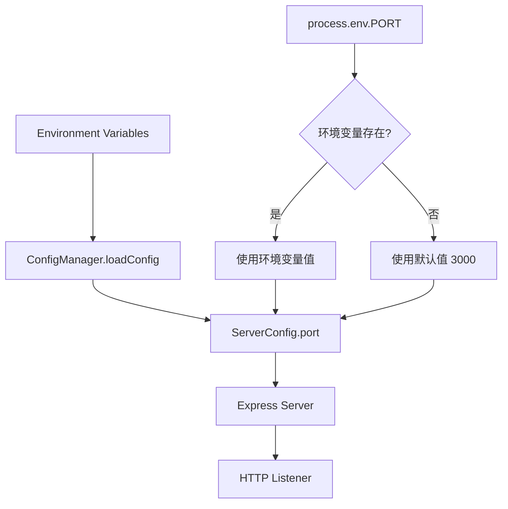
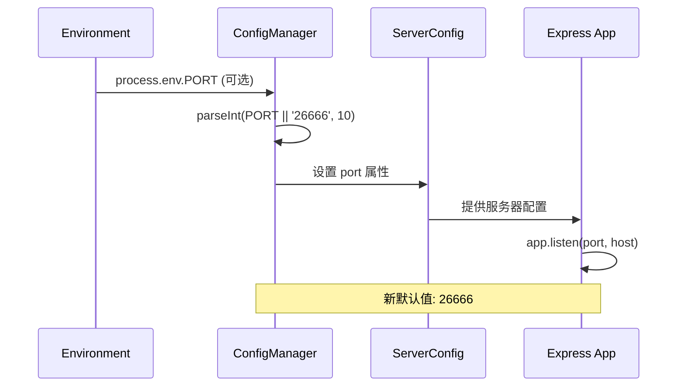

# 修改默认端口设计文档

## 概述

本设计文档描述如何将 OpenClaude 协议转换服务的默认端口从 3000 修改为 26666。此变更涉及配置管理系统的修改，确保新的默认端口在所有相关组件中保持一致。

## 技术栈与依赖

- **运行时**: Node.js + TypeScript
- **框架**: Express.js
- **配置管理**: dotenv + 自定义 ConfigManager
- **环境变量**: PORT (默认值修改)

## 架构分析

### 当前端口配置架构



### 配置加载流程

1. **ConfigManager 初始化**
   - 读取环境变量 `process.env.PORT`
   - 如果未设置，使用硬编码默认值 `'3000'`
   - 解析为整数类型

2. **服务器启动**
   - 从 `configManager.getServerConfig()` 获取端口配置
   - Express 应用监听指定端口
   - 控制台输出服务器地址信息

## 修改方案

### 1. 默认端口值变更

**位置**: `src/config/config-manager.ts`
**行号**: 第 40 行

**当前实现**:
```typescript
const server: ServerConfig = {
  port: parseInt(process.env.PORT || '3000', 10),
  // ...其他配置
};
```

**修改后**:
```typescript
const server: ServerConfig = {
  port: parseInt(process.env.PORT || '26666', 10),
  // ...其他配置
};
```

### 2. 验证规则保持不变

**位置**: `src/config/config-manager.ts`  
**方法**: `validateConfig()`

端口验证逻辑无需修改，26666 在有效范围内 (1-65535)：
```typescript
if (this.config.server.port < 1 || this.config.server.port > 65535) {
  errors.push('PORT must be between 1 and 65535');
}
```

### 3. 文档示例更新

**位置**: `src/index.ts`
**行号**: 第 47 行

**当前示例**:
```typescript
console.log('curl -X POST http://localhost:3000/v1/messages \\');
```

**修改后**:
```typescript
console.log('curl -X POST http://localhost:26666/v1/messages \\');
```

## 影响范围分析

### 直接影响

| 组件 | 影响类型 | 描述 |
|------|----------|------|
| ConfigManager | 代码修改 | 默认端口值从 '3000' 改为 '26666' |
| 启动日志 | 文档更新 | 示例 URL 中的端口更新 |

### 兼容性考虑

- **环境变量优先级**: `PORT` 环境变量仍然具有最高优先级
- **现有部署**: 已设置 `PORT` 环境变量的部署不受影响
- **开发环境**: 新的开发环境默认使用 26666 端口

### 验证点

1. **端口绑定测试**: 确保 26666 端口可正常监听
2. **配置验证**: 验证端口值在合法范围内
3. **环境变量覆盖**: 确认 `PORT` 环境变量仍可覆盖默认值
4. **错误处理**: 端口冲突时的错误信息准确性

## 配置管理流程图



## 测试策略

### 单元测试

1. **配置加载测试**
   ```typescript
   describe('ConfigManager Port Configuration', () => {
     it('should use default port 26666 when PORT env is not set', () => {
       delete process.env.PORT;
       const config = new ConfigManager();
       expect(config.getServerConfig().port).toBe(26666);
     });
     
     it('should use PORT env variable when provided', () => {
       process.env.PORT = '8080';
       const config = new ConfigManager();
       expect(config.getServerConfig().port).toBe(8080);
     });
   });
   ```

2. **端口验证测试**
   ```typescript
   it('should validate port 26666 as valid', () => {
     process.env.PORT = '26666';
     const config = new ConfigManager();
     const validation = config.validateConfig();
     expect(validation.valid).toBe(true);
   });
   ```

### 集成测试

1. **服务器启动测试**: 验证应用可在 26666 端口正常启动
2. **健康检查测试**: 确认 `/health` 端点在新端口上可访问
3. **API 端点测试**: 验证所有 API 路由在新端口上正常工作

## 部署注意事项

### 环境变量配置

生产环境可通过以下方式设置端口:

```bash
# 方式1: 环境变量文件 (.env)
PORT=26666

# 方式2: 系统环境变量
export PORT=26666

# 方式3: Docker 容器
docker run -e PORT=26666 openclaude

# 方式4: 容器编排 (docker-compose.yml)
environment:
  - PORT=26666
```

### 防火墙配置

确保新端口 26666 在防火墙规则中开放:

```bash
# Ubuntu/Debian
sudo ufw allow 26666

# CentOS/RHEL
sudo firewall-cmd --add-port=26666/tcp --permanent
sudo firewall-cmd --reload
```

### 反向代理配置

如使用 Nginx 或其他反向代理，需更新配置:

```nginx
upstream openclaude {
    server localhost:26666;
}
```

## 向后兼容性

| 场景 | 兼容性 | 说明 |
|------|--------|------|
| 现有部署 | ✅ 完全兼容 | 已设置 PORT 环境变量的部署不受影响 |
| 新部署 | ⚠️ 需要更新 | 未设置 PORT 的新部署将使用 26666 |
| 文档示例 | ❌ 需要更新 | API 使用示例中的端口需更新 |
| 开发环境 | ⚠️ 需要适配 | 开发者需要适应新的默认端口 |

## 风险评估

### 低风险

- **端口冲突**: 26666 为非标准端口，冲突概率低
- **配置错误**: 修改点单一，错误风险可控

### 缓解措施

1. **渐进式部署**: 先在测试环境验证
2. **监控告警**: 部署后监控服务健康状态
3. **回滚方案**: 保留原代码版本便于快速回滚

## 实施检查清单

- [ ] 修改 `src/config/config-manager.ts` 中的默认端口值
- [ ] 更新 `src/index.ts` 中的使用示例
- [ ] 验证端口配置加载逻辑
- [ ] 运行配置验证测试
- [ ] 测试环境变量覆盖功能
- [ ] 更新相关文档和示例
- [ ] 部署前环境验证
- [ ] 监控服务启动状态