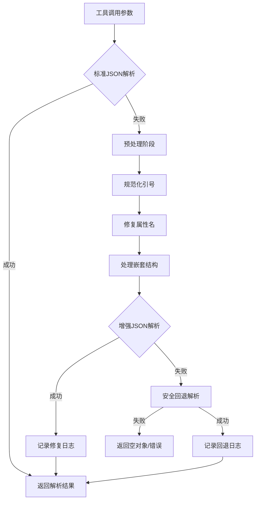
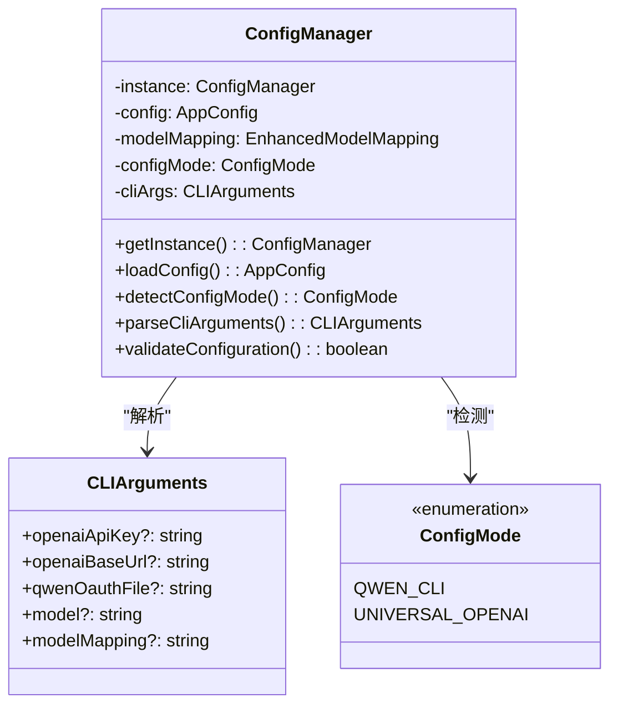
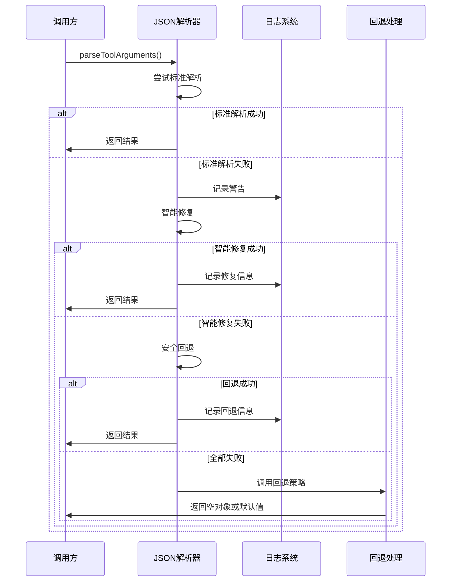
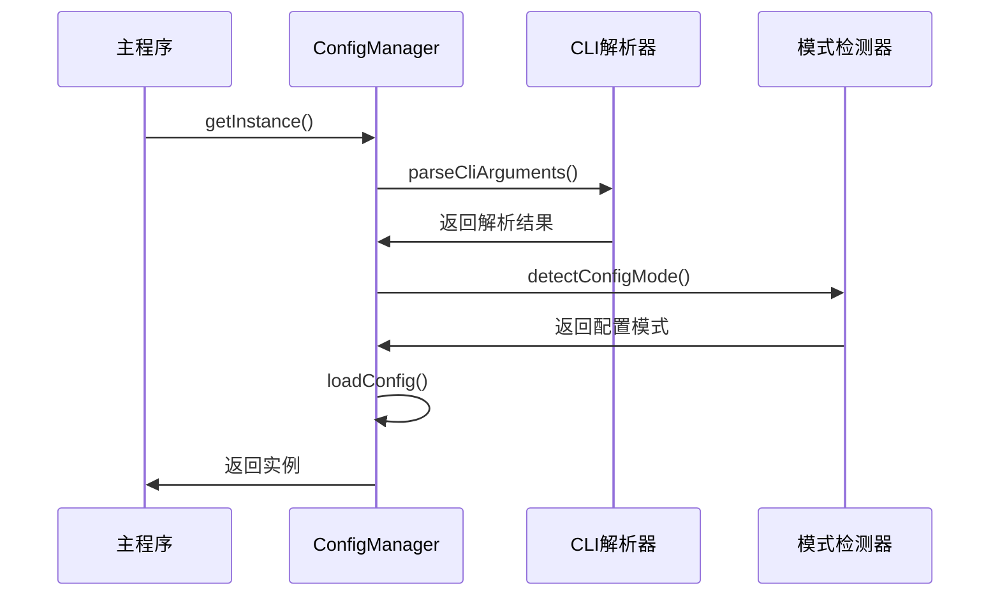

# JSON解析错误修复与命令行参数处理优化设计

## 概述

本设计文档旨在解决OpenCC项目中的两个关键问题：
1. 工具调用参数JSON解析失败导致的错误处理问题
2. 命令行参数未正确触发通用OpenAI模式的配置检测问题

## 技术栈

- **Node.js**: ≥ 18.0.0
- **TypeScript**: v5.3+
- **Express.js**: v4.18.2
- **JSON解析**: 原生JSON.parse + 自定义容错解析器
- **配置管理**: 环境变量 + 命令行参数

## 问题分析

### 1. JSON解析错误问题

**现象**：
```
2025-08-23 16:40:40 [warn]: Standard JSON parse failed, attempting alternative parsing
2025-08-23 16:40:40 [warn]: Smart quote fixing failed, attempting safe eval parsing
```

**根本原因**：
- OpenAI API返回的工具调用参数包含非标准JSON格式（使用单引号）
- 当前解析器的容错机制存在缺陷，无法正确处理复杂的引号混合情况
- 错误的JSON字符串示例：`{'id': '1', 'content': '确定技术栈和框架选型', 'status': 'completed'}`

### 2. 命令行参数配置模式检测问题

**现象**：
用户使用命令行参数启动时仍然走qwen-cli分支：
```bash
npm start -- --openai-base-url=https://api-inference.modelscope.cn/v1 --openai-api-key=ms-ef51e3fc-478f-41e9-8642-769a96da154f --model='deepseek-ai/DeepSeek-V3.1
```

**根本原因**：
- 配置管理器在解析命令行参数时可能存在时序问题
- `detectConfigMode()` 方法在构造函数中调用，此时CLI参数可能尚未完全解析

## 架构设计

### 1. JSON解析器增强架构



### 2. 配置管理器优化架构



## 详细设计

### 1. JSON解析器增强实现

#### 1.1 核心解析策略

采用三级解析策略：

1. **标准解析**：使用原生`JSON.parse()`
2. **智能修复解析**：预处理JSON字符串，修复常见格式问题
3. **安全回退解析**：使用安全的eval方式作为最后手段

#### 1.2 智能修复算法

```typescript
interface JSONParseContext {
  requestId: string;
  toolCallId: string;
  originalString: string;
  attemptCount: number;
}

interface ParseResult {
  success: boolean;
  data?: any;
  method: 'standard' | 'smart-fix' | 'safe-eval' | 'fallback';
  error?: string;
}
```

**关键修复规则**：

基于实际测试案例分析，需要处理以下复杂情况：

1. **混合引号场景处理**：
   - 外层使用双引号包裹的JSON字符串
   - 内层对象属性使用单引号
   - 字符串值内包含双引号和单引号混合
   - 示例：`'content': '完成"用户管理"模块的开发'`

2. **中文内容与特殊字符**：
   - 中文字符不需要转义，直接保留
   - 技术术语和符号（如"React 18+, Vite"）的正确处理
   - 保持原始内容的语义完整性

3. **嵌套引号转义**：
   - 正确识别需要转义的引号位置
   - 避免过度转义导致内容错误
   - 处理如`"Website's API"`这样的复杂情况

4. **数组和对象混合结构**：
   - 长数组（10+元素）的处理效率
   - 保持对象属性顺序（id, content, status）
   - 正确处理数组元素间的逗号分隔

**改进的智能修复算法**：

```typescript
private enhancedSmartFixJsonQuotes(jsonStr: string): string {
  let result = jsonStr.trim();
  
  // 第一步：处理外层JSON字符串包装
  if (result.startsWith('"') && result.endsWith('"')) {
    result = result.slice(1, -1);
    // 处理转义的双引号
    result = result.replace(/\\"/g, '"');
  }
  
  // 第二步：智能识别并修复属性名引号
  result = this.fixPropertyNameQuotes(result);
  
  // 第三步：智能处理字符串值引号
  result = this.fixStringValueQuotes(result);
  
  // 第四步：验证和修复JSON结构
  result = this.validateAndFixStructure(result);
  
  return result;
}

/**
 * 修复属性名引号 - 针对测试案例优化
 */
private fixPropertyNameQuotes(jsonStr: string): string {
  // 匹配模式：{ 或 , 后面的单引号属性名
  return jsonStr.replace(
    /([\{,]\s*)(['"])([a-zA-Z_$][a-zA-Z0-9_$]*)\2(\s*):/g,
    '$1"$3"$4:'
  );
}

/**
 * 智能修复字符串值引号 - 基于上下文分析
 */
private fixStringValueQuotes(jsonStr: string): string {
  let result = '';
  let i = 0;
  let inStringValue = false;
  let stringDelimiter = '';
  let nestLevel = 0;
  
  while (i < jsonStr.length) {
    const char = jsonStr[i];
    const prevChar = i > 0 ? jsonStr[i - 1] : '';
    const nextChar = i < jsonStr.length - 1 ? jsonStr[i + 1] : '';
    
    if (!inStringValue) {
      if (char === ':' && (nextChar === ' ' || nextChar === "'")) {
        // 即将进入字符串值
        result += char;
        i++;
        
        // 跳过空格
        while (i < jsonStr.length && jsonStr[i] === ' ') {
          result += jsonStr[i];
          i++;
        }
        
        // 处理字符串值开始
        if (i < jsonStr.length && jsonStr[i] === "'") {
          result += '"'; // 替换为双引号
          stringDelimiter = "'";
          inStringValue = true;
          i++;
        } else if (i < jsonStr.length && jsonStr[i] === '"') {
          result += char;
          stringDelimiter = '"';
          inStringValue = true;
          i++;
        }
        continue;
      }
      
      result += char;
    } else {
      // 在字符串值内部
      if (char === stringDelimiter && prevChar !== '\\') {
        // 字符串值结束
        if (stringDelimiter === "'") {
          result += '"'; // 替换结束单引号为双引号
        } else {
          result += char;
        }
        inStringValue = false;
        stringDelimiter = '';
      } else if (char === '"' && stringDelimiter === "'") {
        // 在单引号字符串内遇到双引号，需要转义
        result += '\\"';
      } else {
        result += char;
      }
    }
    
    i++;
  }
  
  return result;
}

/**
 * 验证和修复JSON结构完整性
 */
private validateAndFixStructure(jsonStr: string): string {
  let result = jsonStr;
  
  // 修复常见的结构问题
  
  // 1. 移除尾随逗号
  result = result.replace(/,\s*([\}\]])/g, '$1');
  
  // 2. 确保对象和数组正确闭合
  const openBraces = (result.match(/\{/g) || []).length;
  const closeBraces = (result.match(/\}/g) || []).length;
  const openBrackets = (result.match(/\[/g) || []).length;
  const closeBrackets = (result.match(/\]/g) || []).length;
  
  // 补全缺失的闭合符号
  for (let i = closeBraces; i < openBraces; i++) {
    result += '}';
  }
  for (let i = closeBrackets; i < openBrackets; i++) {
    result += ']';
  }
  
  return result;
}
```

#### 1.3 容错处理机制



### 2. 配置管理器优化

#### 2.1 初始化流程优化

**问题修复**：确保CLI参数解析在配置模式检测之前完成



#### 2.2 命令行参数解析增强

**改进点**：

1. **参数验证**：增加参数格式验证
2. **错误处理**：提供更清晰的错误信息
3. **调试信息**：增加调试日志帮助排查问题

```typescript
interface CLIParseResult {
  success: boolean;
  arguments: CLIArguments;
  errors: string[];
  debugInfo: {
    processArgv: string[];
    parsedCount: number;
    detectedMode: ConfigMode;
  };
}
```

#### 2.3 配置模式检测逻辑

**优化策略**：

```typescript
private detectConfigMode(): ConfigMode {
  const debugInfo = {
    hasEnvKey: !!process.env.OPENAI_API_KEY,
    hasEnvBaseUrl: !!process.env.OPENAI_BASE_URL,
    hasCliKey: !!this.cliArgs.openaiApiKey,
    hasCliBaseUrl: !!this.cliArgs.openaiBaseUrl,
    cliArgsCount: Object.keys(this.cliArgs).length
  };
  
  const hasOpenAIKey = debugInfo.hasEnvKey || debugInfo.hasCliKey;
  const hasOpenAIBaseUrl = debugInfo.hasEnvBaseUrl || debugInfo.hasCliBaseUrl;
  
  const mode = (hasOpenAIKey || hasOpenAIBaseUrl) ? 
    ConfigMode.UNIVERSAL_OPENAI : 
    ConfigMode.QWEN_CLI;
    
  logger.debug('Configuration mode detection', {
    mode,
    ...debugInfo
  });
  
  return mode;
}
```

## 实现方案

### 1. JSON解析器修复

**文件**：`src/converters/openai-to-anthropic-response.ts`

**关键方法优化**：

- `parseToolArguments()`: 增强错误处理和日志记录
- `smartFixJsonQuotes()`: 改进引号修复算法
- `fixValueQuotes()`: 优化值引号处理逻辑
- 新增 `validateJsonStructure()`: JSON结构验证
- 新增 `createFallbackResult()`: 创建安全的回退结果

### 2. 配置管理器修复

**文件**：`src/config/config-manager.ts`

**关键改进**：

- 构造函数重构：确保正确的初始化顺序
- `parseCliArguments()`: 增加参数验证和调试信息
- `detectConfigMode()`: 增加详细的调试日志
- 新增 `validateCliArguments()`: CLI参数验证方法

### 3. 日志增强

**改进内容**：

- 增加JSON解析过程的详细日志
- 添加配置模式检测的调试信息
- 优化错误信息的可读性

### 4. 测试策略

#### 4.1 JSON解析器测试

**核心测试案例**：

以下是从实际生产环境中收集的失败案例，JSON解析器必须能够正确处理这些情况：

**案例1：混合引号与转义字符**
```json
"{\"todos\": [{'content': '完成\"用户管理\"模块的开发', 'id': '1', 'status': 'pending'}, {'content': \"处理用户反馈中的'性能问题'\", 'id': '2', 'status': 'pending'}, {'content': '修复\"登录页面\"的显示异常', 'id': '3', 'status': 'pending'}, {'content': \"优化数据库查询语句'select'\", 'id': '4', 'status': 'pending'}, {'content': '更新\"Website's API\"文档', 'id': '5', 'status': 'pending'}]}"
```

**案例2：中文内容与单引号数组**
```json
"{\"todos\": [{'content': '确定技术栈和工具链', 'id': '2', 'status': 'completed'}, {'content': '设计项目结构和目录组织', 'id': '3', 'status': 'in_progress'}, {'content': '创建项目基础环境', 'id': '4', 'status': 'pending'}, {'content': '搭建路由和布局框架', 'id': '5', 'status': 'pending'}, {'content': '实现用户认证和权限系统', 'id': '6', 'status': 'pending'}, {'content': '开发核心功能模块', 'id': '7', 'status': 'pending'}, {'content': '实现响应式设计', 'id': '8', 'status': 'pending'}, {'content': '测试和优化性能', 'id': '9', 'status': 'pending'}]}"
```

**案例3：长数组与技术术语**
```json
"{\"todos\": [{'id': '1', 'content': '创建项目初始化任务列表', 'status': 'completed'}, {'id': '2', 'content': '分析用户需求并制定技术方案', 'status': 'completed'}, {'id': '3', 'content': '确定技术栈：React 18+, Vite, TypeScript, Mantine UI', 'status': 'completed'}, {'id': '4', 'content': '设计项目结构和目录布局', 'status': 'in_progress'}, {'id': '5', 'content': '搭建开发环境和基础配置', 'status': 'completed'}, {'id': '6', 'content': '实现核心UI组件和布局', 'status': 'pending'}, {'id': '7', 'content': '开发基础页面模板', 'status': 'pending'}, {'id': '8', 'content': '集成状态管理和路由', 'status': 'pending'}, {'id': '9', 'content': '实现权限控制机制', 'status': 'pending'}, {'id': '10', 'content': '添加响应式设计支持', 'status': 'pending'}, {'id': '11', 'content': '进行测试和优化', 'status': 'pending'}]}"
```

**期望解析结果**：

所有案例都应该能够正确解析为标准的JavaScript对象，包含todos数组，每个元素具有id、content、status属性。

**测试验证标准**：

1. **解析成功率**：所有测试案例必须100%解析成功
2. **内容完整性**：解析后的对象必须包含所有原始数据
3. **数据类型正确性**：字符串、数组、对象类型必须正确
4. **特殊字符处理**：引号、转义字符、中文字符必须正确处理
5. **性能要求**：每个案例解析时间不超过10ms

**测试实现方案**：

```typescript
// 测试数据定义
const TEST_CASES = [
  {
    name: '案例1-混合引号与转义字符',
    input: `{"todos": [{'content': '完成"用户管理"模块的开发', 'id': '1', 'status': 'pending'}, {'content': "处理用户反馈中的'性能问题'", 'id': '2', 'status': 'pending'}, {'content': '修复"登录页面"的显示异常', 'id': '3', 'status': 'pending'}, {'content': "优化数据库查询语句'select'", 'id': '4', 'status': 'pending'}, {'content': '更新"Website\'s API"文档', 'id': '5', 'status': 'pending'}]}`,
    expected: {
      todos: [
        { content: '完成"用户管理"模块的开发', id: '1', status: 'pending' },
        { content: "处理用户反馈中的'性能问题'", id: '2', status: 'pending' },
        { content: '修复"登录页面"的显示异常', id: '3', status: 'pending' },
        { content: "优化数据库查询语句'select'", id: '4', status: 'pending' },
        { content: '更新"Website\'s API"文档', id: '5', status: 'pending' }
      ]
    }
  },
  {
    name: '案例2-中文内容与单引号数组',
    input: `{"todos": [{'content': '确定技术栈和工具链', 'id': '2', 'status': 'completed'}, {'content': '设计项目结构和目录组织', 'id': '3', 'status': 'in_progress'}, {'content': '创建项目基础环境', 'id': '4', 'status': 'pending'}, {'content': '搭建路由和布局框架', 'id': '5', 'status': 'pending'}, {'content': '实现用户认证和权限系统', 'id': '6', 'status': 'pending'}, {'content': '开发核心功能模块', 'id': '7', 'status': 'pending'}, {'content': '实现响应式设计', 'id': '8', 'status': 'pending'}, {'content': '测试和优化性能', 'id': '9', 'status': 'pending'}]}`,
    expected: {
      todos: [
        { content: '确定技术栈和工具链', id: '2', status: 'completed' },
        { content: '设计项目结构和目录组织', id: '3', status: 'in_progress' },
        { content: '创建项目基础环境', id: '4', status: 'pending' },
        { content: '搭建路由和布局框架', id: '5', status: 'pending' },
        { content: '实现用户认证和权限系统', id: '6', status: 'pending' },
        { content: '开发核心功能模块', id: '7', status: 'pending' },
        { content: '实现响应式设计', id: '8', status: 'pending' },
        { content: '测试和优化性能', id: '9', status: 'pending' }
      ]
    }
  },
  {
    name: '案例3-长数组与技术术语',
    input: `{"todos": [{'id': '1', 'content': '创建项目初始化任务列表', 'status': 'completed'}, {'id': '2', 'content': '分析用户需求并制定技术方案', 'status': 'completed'}, {'id': '3', 'content': '确定技术栈：React 18+, Vite, TypeScript, Mantine UI', 'status': 'completed'}, {'id': '4', 'content': '设计项目结构和目录布局', 'status': 'in_progress'}, {'id': '5', 'content': '搭建开发环境和基础配置', 'status': 'completed'}, {'id': '6', 'content': '实现核心UI组件和布局', 'status': 'pending'}, {'id': '7', 'content': '开发基础页面模板', 'status': 'pending'}, {'id': '8', 'content': '集成状态管理和路由', 'status': 'pending'}, {'id': '9', 'content': '实现权限控制机制', 'status': 'pending'}, {'id': '10', 'content': '添加响应式设计支持', 'status': 'pending'}, {'id': '11', 'content': '进行测试和优化', 'status': 'pending'}]}`,
    expected: {
      todos: [
        { id: '1', content: '创建项目初始化任务列表', status: 'completed' },
        { id: '2', content: '分析用户需求并制定技术方案', status: 'completed' },
        { id: '3', content: '确定技术栈：React 18+, Vite, TypeScript, Mantine UI', status: 'completed' },
        { id: '4', content: '设计项目结构和目录布局', status: 'in_progress' },
        { id: '5', content: '搭建开发环境和基础配置', status: 'completed' },
        { id: '6', content: '实现核心UI组件和布局', status: 'pending' },
        { id: '7', content: '开发基础页面模板', status: 'pending' },
        { id: '8', content: '集成状态管理和路由', status: 'pending' },
        { id: '9', content: '实现权限控制机制', status: 'pending' },
        { id: '10', content: '添加响应式设计支持', status: 'pending' },
        { id: '11', content: '进行测试和优化', status: 'pending' }
      ]
    }
  }
];

// 测试执行函数
describe('JSON解析器核心测试', () => {
  const converter = new OpenAIToAnthropicResponseConverter();
  
  TEST_CASES.forEach((testCase, index) => {
    it(`应能正确解析${testCase.name}`, () => {
      const startTime = performance.now();
      
      // 执行解析
      const result = converter.parseToolArguments(
        testCase.input,
        `test_request_${index}`,
        `test_tool_call_${index}`
      );
      
      const endTime = performance.now();
      const duration = endTime - startTime;
      
      // 验证解析结果
      expect(result).toEqual(testCase.expected);
      
      // 验证性能要求
      expect(duration).toBeLessThan(10); // 小于10ms
      
      // 验证数据完整性
      expect(result.todos).toBeDefined();
      expect(Array.isArray(result.todos)).toBe(true);
      expect(result.todos.length).toEqual(testCase.expected.todos.length);
      
      // 验证每个todo项的结构
      result.todos.forEach((todo, i) => {
        expect(todo).toHaveProperty('id');
        expect(todo).toHaveProperty('content');
        expect(todo).toHaveProperty('status');
        expect(todo.content).toBe(testCase.expected.todos[i].content);
      });
    });
  });
  
  it('应能处理解析失败的情况', () => {
    const malformedJson = `{"todos": [{'id': '1', 'content': '未闭合字符串, 'status': 'pending'}]}`;
    
    // 不应该抛出异常
    expect(() => {
      converter.parseToolArguments(malformedJson, 'test_request', 'test_tool_call');
    }).not.toThrow();
  });
  
  it('应能记录详细的解析日志', () => {
    const logSpy = jest.spyOn(console, 'log');
    
    converter.parseToolArguments(
      TEST_CASES[0].input,
      'log_test_request',
      'log_test_tool_call'
    );
    
    // 验证日志记录
    expect(logSpy).toHaveBeenCalled();
    logSpy.mockRestore();
  });
});
```


1. **标准JSON格式**：验证正常解析不受影响
2. **空数组和空对象**：`{"todos": []}`, `{}`
3. **恶意输入**：验证安全性，防止代码注入
4. **边界情况**：空字符串、null、超长字符串
5. **嵌套结构**：多层嵌套的对象和数组
6. **数值和布尔值**：混合数据类型的处理

#### 4.2 配置管理器测试

**命令行参数测试案例**：

针对用户遇到的具体问题，需要验证以下命令行参数组合：

**测试案例1：用户实际失败命令**
```bash
npm start -- --openai-base-url=https://api-inference.modelscope.cn/v1 --openai-api-key=ms-ef51e3fc-478f-41e9-8642-769a96da154f --model='deepseek-ai/DeepSeek-V3.1
```

期望结果：
- 配置模式：`UNIVERSAL_OPENAI`
- 正确识别和解析所有参数
- 不应该走qwen-cli分支

**测试案例2：正常OpenAI配置**
```bash
npm start -- --openai-api-key sk-test123 --openai-base-url https://api.openai.com/v1
```

**测试案例3：混合环境变量和命令行参数**
```bash
export OPENAI_API_KEY=sk-env-key
npm start -- --openai-base-url https://custom.api.com/v1
```

**测试案例4：缺少参数值的情况**
```bash
npm start -- --openai-api-key --openai-base-url
```

**测试实现代码**：

```typescript
describe('配置管理器命令行参数测试', () => {
  let originalArgv: string[];
  let originalEnv: NodeJS.ProcessEnv;
  
  beforeEach(() => {
    originalArgv = process.argv;
    originalEnv = { ...process.env };
    
    // 清除环境变量
    delete process.env.OPENAI_API_KEY;
    delete process.env.OPENAI_BASE_URL;
  });
  
  afterEach(() => {
    process.argv = originalArgv;
    process.env = originalEnv;
  });
  
  it('应能正确解析用户实际失败的命令行参数', () => {
    // 模拟用户的实际命令
    process.argv = [
      'node',
      'dist/index.js',
      '--openai-base-url=https://api-inference.modelscope.cn/v1',
      '--openai-api-key=ms-ef51e3fc-478f-41e9-8642-769a96da154f',
      '--model=deepseek-ai/DeepSeek-V3.1'
    ];
    
    const configManager = new (ConfigManager as any)();
    const config = configManager.getConfig();
    const mode = configManager.getConfigMode();
    
    // 验证配置模式
    expect(mode).toBe(ConfigMode.UNIVERSAL_OPENAI);
    
    // 验证参数解析
    expect(config.openai.baseUrl).toBe('https://api-inference.modelscope.cn/v1');
    expect(config.openai.apiKey).toBe('ms-ef51e3fc-478f-41e9-8642-769a96da154f');
    expect(config.openai.defaultModel).toBe('deepseek-ai/DeepSeek-V3.1');
    expect(config.openai.configMode).toBe(ConfigMode.UNIVERSAL_OPENAI);
  });
  
  it('应能处理不同的参数格式', () => {
    // 测试空格分隔的参数格式
    process.argv = [
      'node',
      'dist/index.js',
      '--openai-base-url', 'https://api.openai.com/v1',
      '--openai-api-key', 'sk-test123',
      '--model', 'gpt-4'
    ];
    
    const configManager = new (ConfigManager as any)();
    const config = configManager.getConfig();
    
    expect(config.openai.baseUrl).toBe('https://api.openai.com/v1');
    expect(config.openai.apiKey).toBe('sk-test123');
    expect(config.openai.defaultModel).toBe('gpt-4');
  });
  
  it('应能正确处理参数优先级', () => {
    // 设置环境变量
    process.env.OPENAI_API_KEY = 'sk-env-key';
    
    // 设置命令行参数
    process.argv = [
      'node',
      'dist/index.js',
      '--openai-api-key', 'sk-cli-key',
      '--openai-base-url', 'https://custom.api.com/v1'
    ];
    
    const configManager = new (ConfigManager as any)();
    const config = configManager.getConfig();
    
    // CLI参数应该优先于环境变量
    expect(config.openai.apiKey).toBe('sk-cli-key');
    expect(config.openai.baseUrl).toBe('https://custom.api.com/v1');
  });
  
  it('应能处理缺少参数值的情况', () => {
    process.argv = [
      'node',
      'dist/index.js',
      '--openai-api-key', // 缺少值
      '--openai-base-url', // 缺少值
    ];
    
    // 不应该抛出异常
    expect(() => {
      new (ConfigManager as any)();
    }).not.toThrow();
  });
  
  it('应能记录详细的调试信息', () => {
    const logSpy = jest.spyOn(console, 'debug');
    
    process.argv = [
      'node',
      'dist/index.js',
      '--openai-api-key', 'sk-test',
      '--openai-base-url', 'https://test.com'
    ];
    
    const configManager = new (ConfigManager as any)();
    
    // 验证调试日志被记录
    expect(logSpy).toHaveBeenCalledWith(
      expect.stringContaining('Configuration mode detection'),
      expect.objectContaining({
        mode: ConfigMode.UNIVERSAL_OPENAI,
        hasCliKey: true,
        hasCliBaseUrl: true
      })
    );
    
    logSpy.mockRestore();
  });
});
```

**性能和稳定性测试**：

```typescript
describe('配置管理器性能测试', () => {
  it('初始化时间应在可接受范围内', () => {
    const startTime = performance.now();
    
    process.argv = [
      'node', 'dist/index.js',
      '--openai-api-key', 'sk-test',
      '--openai-base-url', 'https://test.com',
      '--model', 'gpt-4'
    ];
    
    const configManager = new (ConfigManager as any)();
    
    const endTime = performance.now();
    const duration = endTime - startTime;
    
    // 初始化时间应小于100ms
    expect(duration).toBeLessThan(100);
  });
  
  it('应能处理大量参数而不影响性能', () => {
    const manyArgs = ['node', 'dist/index.js'];
    
    // 添加100个无关参数
    for (let i = 0; i < 100; i++) {
      manyArgs.push(`--unknown-param-${i}`, `value-${i}`);
    }
    
    manyArgs.push('--openai-api-key', 'sk-test');
    process.argv = manyArgs;
    
    const startTime = performance.now();
    const configManager = new (ConfigManager as any)();
    const endTime = performance.now();
    
    expect(endTime - startTime).toBeLessThan(50);
    expect(configManager.getConfig().openai.apiKey).toBe('sk-test');
  });
});
```

## 监控和调试

### 1. 关键指标

- JSON解析成功率
- 各解析方法使用频率
- 配置模式检测准确性
- 错误类型分布

### 2. 调试日志

```typescript
interface JSONParseMetrics {
  totalAttempts: number;
  successByMethod: {
    standard: number;
    smartFix: number;
    safeEval: number;
    fallback: number;
  };
  errorTypes: {
    syntaxError: number;
    unexpectedToken: number;
    unclosedString: number;
    other: number;
  };
}
```

### 3. 健康检查

新增配置管理和JSON解析器的健康检查端点：

- `/health/json-parser`: JSON解析器状态
- `/health/config`: 配置管理器状态
- `/health/detailed`: 详细的系统健康信息

## 回滚策略

### 1. JSON解析器回滚

如果新的解析器出现问题：

1. **快速回滚**：恢复到原始的简单解析逻辑
2. **降级模式**：禁用智能修复，只使用标准解析
3. **错误忽略**：对解析失败的工具调用进行优雅降级

### 2. 配置管理器回滚

如果配置检测出现问题：

1. **固定模式**：临时固定为特定配置模式
2. **手动配置**：提供手动指定配置模式的环境变量
3. **配置验证**：增加启动时的配置验证步骤

## 性能考虑

### 1. JSON解析性能

- **缓存机制**：对常见的JSON格式缓存解析结果
- **快速路径**：对标准格式提供快速解析路径
- **限制处理**：对超长字符串进行长度限制

### 2. 配置管理性能

- **单例模式**：确保配置管理器只初始化一次
- **延迟加载**：非关键配置延迟加载
- **内存优化**：避免重复存储配置数据```typescript
interface JSONParseMetrics {
  totalAttempts: number;
  successByMethod: {
    standard: number;
    smartFix: number;
    safeEval: number;
    fallback: number;
  };
  errorTypes: {
    syntaxError: number;
    unexpectedToken: number;
    unclosedString: number;
    other: number;
  };
}
```

### 3. 健康检查

新增配置管理和JSON解析器的健康检查端点：

- `/health/json-parser`: JSON解析器状态
- `/health/config`: 配置管理器状态
- `/health/detailed`: 详细的系统健康信息

## 回滚策略

### 1. JSON解析器回滚

如果新的解析器出现问题：

1. **快速回滚**：恢复到原始的简单解析逻辑
2. **降级模式**：禁用智能修复，只使用标准解析
3. **错误忽略**：对解析失败的工具调用进行优雅降级

### 2. 配置管理器回滚

如果配置检测出现问题：

1. **固定模式**：临时固定为特定配置模式
2. **手动配置**：提供手动指定配置模式的环境变量
3. **配置验证**：增加启动时的配置验证步骤

## 性能考虑

### 1. JSON解析性能

- **缓存机制**：对常见的JSON格式缓存解析结果
- **快速路径**：对标准格式提供快速解析路径
- **限制处理**：对超长字符串进行长度限制

### 2. 配置管理性能

- **单例模式**：确保配置管理器只初始化一次
- **延迟加载**：非关键配置延迟加载
- **内存优化**：避免重复存储配置数据


