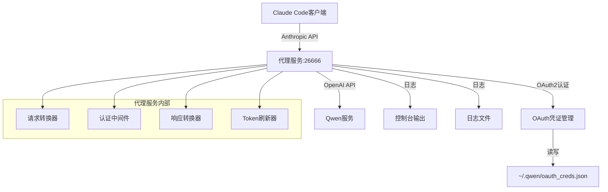
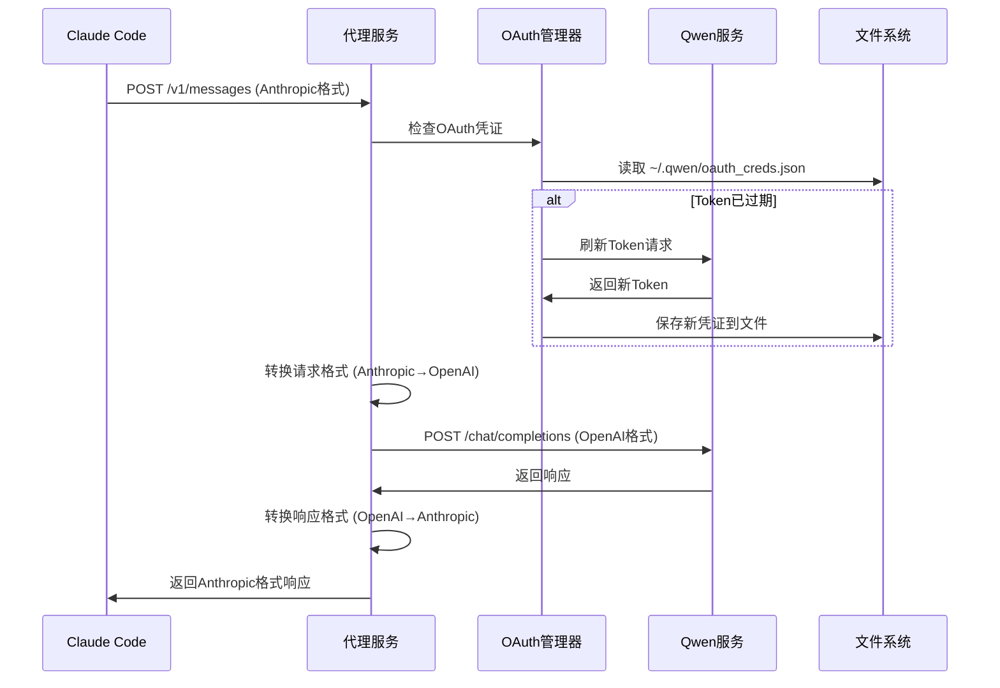
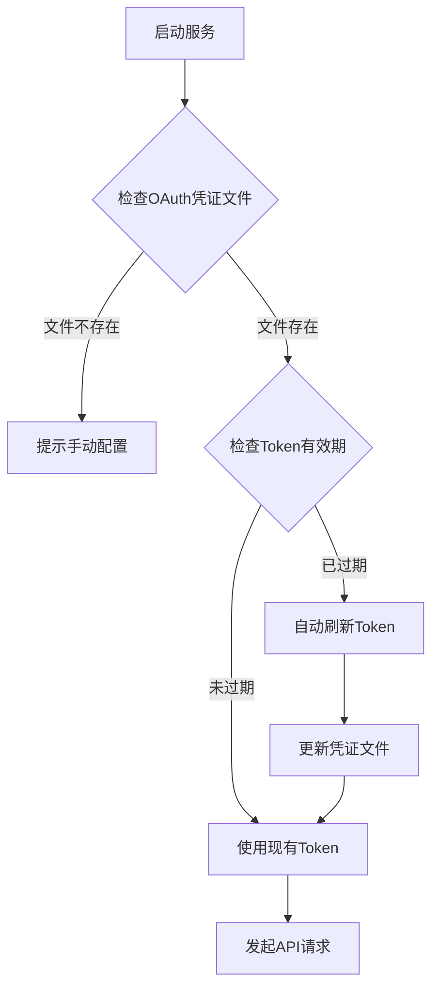
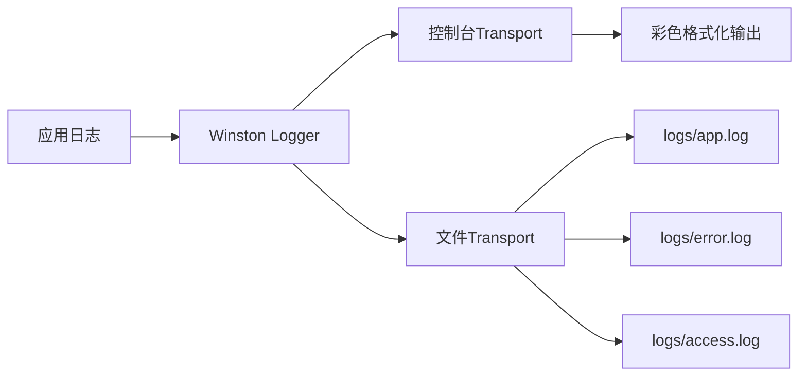

# Qwen API代理服务设计文档

## 概述

本项目是一个API代理服务，用于将Claude Code客户端的Anthropic API调用转换为Qwen AI的OpenAI兼容API调用。通过OAuth2认证机制连接Qwen服务，实现seamless的AI模型切换。

### 核心功能
- 接收Anthropic API格式的请求
- 通过OAuth2认证访问Qwen服务
- 将请求转换为OpenAI格式并转发到Qwen
- 返回转换后的响应给Claude Code客户端
- 自动token刷新和持久化存储
- 完整的日志记录到文件和控制台

### 技术栈
- **框架**: Express.js + TypeScript
- **认证**: OAuth2 with refresh token
- **协议转换**: Anthropic ↔ OpenAI API
- **配置管理**: 环境变量 + JSON配置
- **日志**: Winston双重输出（控制台+文件）
- **限流**: Express Rate Limiter

## 架构设计

### 系统架构图



### 数据流程图



## API端点设计

### 主要端点

| 端点 | 方法 | 描述 | 认证 |
|------|------|------|------|
| `/v1/messages` | POST | 消息处理端点 | 可选 |
| `/v1/models` | GET | 模型列表 | 可选 |
| `/health` | GET | 健康检查 | 无 |

### 消息端点详细设计

#### 请求格式 (Anthropic)
```json
{
  "model": "claude-3-opus-20240229",
  "max_tokens": 1024,
  "messages": [
    {
      "role": "user",
      "content": "Hello"
    }
  ]
}
```

#### 转换后格式 (OpenAI)
```json
{
  "model": "qwen3-coder-plus",
  "max_tokens": 1024,
  "messages": [
    {
      "role": "user", 
      "content": "Hello"
    }
  ]
}
```

#### 响应格式转换
```json
// OpenAI响应 → Anthropic响应
{
  "id": "msg_xxx",
  "type": "message",
  "role": "assistant",
  "content": [
    {
      "type": "text",
      "text": "响应内容"
    }
  ],
  "model": "claude-3-opus-20240229",
  "usage": {
    "input_tokens": 10,
    "output_tokens": 25
  }
}
```

## OAuth2认证架构

### 认证流程设计



### OAuth凭证管理器

#### 凭证文件结构
```json
{
  "access_token": "eyJhbGciOiJSUzI1NiIs...",
  "refresh_token": "v1.M2YyZDYzNjMt...",
  "expiry_date": 1704067200000,
  "resource_url": "chat.qwen.ai"
}
```

#### 核心接口设计

```typescript
interface QwenOAuthManager {
  // 获取有效的访问令牌
  getValidAccessToken(): Promise<string>;
  
  // 刷新访问令牌
  refreshAccessToken(refreshToken: string): Promise<OAuthCredentials>;
  
  // 保存凭证到文件
  saveCredentials(credentials: OAuthCredentials): Promise<void>;
  
  // 从文件加载凭证
  loadCredentials(): Promise<OAuthCredentials | null>;
  
  // 检查Token是否需要刷新
  needsRefresh(credentials: OAuthCredentials): boolean;
}
```

### Token刷新机制

```typescript
class TokenRefreshManager {
  async refreshToken(refreshToken: string): Promise<OAuthCredentials> {
    const formData = new URLSearchParams();
    formData.append('client_id', 'f0304373b74a44d2b584a3fb70ca9e56');
    formData.append('refresh_token', refreshToken);
    formData.append('grant_type', 'refresh_token');
    
    const response = await fetch('https://chat.qwen.ai/api/v1/oauth2/token', {
      method: 'POST',
      headers: { 'Content-Type': 'application/x-www-form-urlencoded' },
      body: formData
    });
    
    const data = await response.json();
    
    return {
      access_token: data.access_token,
      refresh_token: data.refresh_token, // 新的刷新Token
      expiry_date: Date.now() + (data.expires_in * 1000) - 60000, // 提前1分钟过期
      resource_url: data.resource_url || 'chat.qwen.ai'
    };
  }
}
```

## 协议转换层设计

### 模型配置
由于固定使用qwen3-coder-plus模型，无需复杂的模型映射配置。配置简化如下：

```json
{
  "targetModel": "qwen3-coder-plus",
  "defaultCapabilities": {
    "contextLength": 32768,
    "maxTokens": 8192,
    "supportedFeatures": ["text", "code", "reasoning"]
  },
  "logOriginalModel": true
}
```

### 请求转换器

```typescript
class AnthropicToOpenAIConverter {
  convertRequest(anthropicRequest: AnthropicRequest, requestId: string): OpenAIRequest {
    // 记录原始模型信息到日志
    logger.info('Converting request with original model', {
      requestId,
      originalModel: anthropicRequest.model,
      targetModel: 'qwen3-coder-plus',
      messageCount: anthropicRequest.messages?.length || 0
    });
    
    return {
      model: 'qwen3-coder-plus', // 固定使用此模型
      messages: this.convertMessages(anthropicRequest.messages),
      max_tokens: anthropicRequest.max_tokens,
      temperature: anthropicRequest.temperature,
      stream: anthropicRequest.stream,
      stop: anthropicRequest.stop
    };
  }
  
  convertMessages(messages: AnthropicMessage[]): OpenAIMessage[] {
    return messages.map(msg => ({
      role: msg.role,
      content: this.convertContent(msg.content)
    }));
  }
  
  convertContent(content: AnthropicContent): string {
    if (typeof content === 'string') return content;
    if (Array.isArray(content)) {
      return content
        .filter(block => block.type === 'text')
        .map(block => block.text)
        .join('\n');
    }
    return '';
  }
}
```

### 响应转换器

```typescript
class OpenAIToAnthropicConverter {
  convertResponse(
    openaiResponse: OpenAIResponse, 
    originalModel: string,
    requestId: string
  ): AnthropicResponse {
    const choice = openaiResponse.choices[0];
    
    // 记录响应转换信息
    logger.info('Converting response back to Anthropic format', {
      requestId,
      originalModel,
      qwenModel: openaiResponse.model,
      inputTokens: openaiResponse.usage?.prompt_tokens || 0,
      outputTokens: openaiResponse.usage?.completion_tokens || 0
    });
    
    return {
      id: `msg_${openaiResponse.id}`,
      type: 'message',
      role: 'assistant',
      content: [
        {
          type: 'text',
          text: choice.message.content
        }
      ],
      model: originalModel, // 返回客户端原始请求的模型
      stop_reason: this.convertFinishReason(choice.finish_reason),
      usage: {
        input_tokens: openaiResponse.usage?.prompt_tokens || 0,
        output_tokens: openaiResponse.usage?.completion_tokens || 0
      }
    };
  }
  
  convertFinishReason(reason: string): string {
    const mapping = {
      'stop': 'end_turn',
      'length': 'max_tokens',
      'tool_calls': 'tool_use',
      'content_filter': 'stop_sequence'
    };
    return mapping[reason] || 'end_turn';
  }
}
```

## 日志系统设计

### 双重输出架构



### 日志配置

```typescript
const loggerConfig = {
  level: 'info',
  format: winston.format.combine(
    winston.format.timestamp(),
    winston.format.errors({ stack: true }),
    winston.format.json()
  ),
  transports: [
    // 控制台输出 - 彩色格式
    new winston.transports.Console({
      format: winston.format.combine(
        winston.format.colorize(),
        winston.format.simple()
      )
    }),
    
    // 文件输出 - JSON格式
    new winston.transports.File({ 
      filename: 'logs/error.log', 
      level: 'error' 
    }),
    new winston.transports.File({ 
      filename: 'logs/app.log' 
    }),
    
    // 按日期轮转
    new winston.transports.DailyRotateFile({
      filename: 'logs/access-%DATE%.log',
      datePattern: 'YYYY-MM-DD',
      maxSize: '20m',
      maxFiles: '14d'
    })
  ]
};
```

### 日志级别策略

| 级别 | 用途 | 示例 |
|------|------|------|
| error | 错误和异常 | OAuth刷新失败、API调用错误 |
| warn | 警告信息 | Token即将过期、速率限制 |
| info | 关键操作 | 请求处理、Token刷新成功 |
| debug | 调试信息 | 请求/响应详细内容 |
| trace | 追踪信息 | 内部函数调用流程 |

### 结构化日志示例

```json
// 请求转换日志
{
  "timestamp": "2024-01-15T10:30:00.000Z",
  "level": "info",
  "message": "Converting request with original model",
  "requestId": "req_123456",
  "originalModel": "claude-3-opus-20240229",
  "targetModel": "qwen3-coder-plus",
  "messageCount": 1
}

// 响应转换日志
{
  "timestamp": "2024-01-15T10:30:01.500Z",
  "level": "info",
  "message": "Converting response back to Anthropic format",
  "requestId": "req_123456",
  "originalModel": "claude-3-opus-20240229",
  "qwenModel": "qwen3-coder-plus",
  "inputTokens": 15,
  "outputTokens": 42,
  "duration": 1500
}

// OAuth刷新日志
{
  "timestamp": "2024-01-15T10:25:00.000Z",
  "level": "info",
  "message": "OAuth token refreshed successfully",
  "operation": "token_refresh",
  "duration": 245,
  "metadata": {
    "oldTokenExpiry": "2024-01-15T10:25:00.000Z",
    "newTokenExpiry": "2024-01-15T11:25:00.000Z"
  }
}
```

## 中间件系统

### 认证中间件

```typescript
class AuthenticationMiddleware {
  // 可选认证 - 不验证ANTHROPIC_AUTH_TOKEN
  async optionalAuth(req: Request, res: Response, next: NextFunction) {
    // 跳过token验证，直接通过
    req.authenticated = true;
    req.authToken = 'sk-qwen'; // 固定标识
    next();
  }
}
```

### OAuth中间件

```typescript
class OAuthMiddleware {
  async ensureValidToken(req: Request, res: Response, next: NextFunction) {
    try {
      const token = await this.oauthManager.getValidAccessToken();
      req.qwenAccessToken = token;
      next();
    } catch (error) {
      logger.error('OAuth token acquisition failed', { error });
      res.status(401).json({
        error: {
          type: 'authentication_error',
          message: 'Failed to obtain valid Qwen access token'
        }
      });
    }
  }
}
```

### 请求转换中间件

```typescript
class ConversionMiddleware {
  async convertRequest(req: Request, res: Response, next: NextFunction) {
    try {
      // 保存原始模型信息
      req.originalModel = req.body.model;
      
      // 记录原始请求
      logger.debug('Converting Anthropic request', { 
        originalModel: req.originalModel,
        requestId: req.requestId,
        messageCount: req.body.messages?.length || 0
      });
      
      // 执行转换（包含模型信息记录）
      req.convertedBody = this.converter.anthropicToOpenAI(req.body, req.requestId);
      
      next();
    } catch (error) {
      logger.error('Request conversion failed', { 
        error, 
        requestId: req.requestId,
        originalModel: req.originalModel 
      });
      next(error);
    }
  }
  
  async convertResponse(openaiResponse: any, req: Request): Promise<any> {
    return this.converter.openaiToAnthropic(
      openaiResponse, 
      req.originalModel, 
      req.requestId
    );
  }
}
```

## 配置管理

### 环境变量配置

```bash
# 服务配置
PORT=26666
HOST=localhost
NODE_ENV=development

# OAuth配置文件路径
QWEN_OAUTH_CREDS_PATH=~/.qwen/oauth_creds.json

# 日志配置
LOG_LEVEL=info
LOG_TO_FILE=true
LOG_FILE_PATH=./logs/app.log
VERBOSE_LOGGING=false

# 速率限制
RATE_LIMIT_WINDOW_MS=900000
RATE_LIMIT_MAX_REQUESTS=100

# 请求配置
REQUEST_TIMEOUT=60000
MAX_REQUEST_SIZE=10mb

# 调试模式
DEBUG_MODE=false
```

### Claude Code客户端配置

```bash
# 设置代理服务地址
export ANTHROPIC_BASE_URL=http://127.0.0.1:26666

# 设置认证Token（固定值，服务端不验证）
export ANTHROPIC_AUTH_TOKEN=sk-qwen
```

### 动态配置管理

```typescript
class ConfigManager {
  private qwenConfig: QwenConfig;
  
  async loadQwenConfig(): Promise<void> {
    const credsPath = this.getOAuthCredsPath();
    try {
      const credentials = await this.loadOAuthCredentials(credsPath);
      this.qwenConfig = {
        baseUrl: `https://${credentials.resource_url}`,
        accessToken: credentials.access_token,
        refreshToken: credentials.refresh_token,
        expiryDate: credentials.expiry_date
      };
    } catch (error) {
      logger.warn('Failed to load Qwen OAuth credentials', { error });
      throw new Error('Qwen OAuth credentials not found or invalid');
    }
  }
  
  private getOAuthCredsPath(): string {
    return process.env.QWEN_OAUTH_CREDS_PATH || 
           path.join(os.homedir(), '.qwen', 'oauth_creds.json');
  }
}
```

## 测试策略

### 单元测试设计

```typescript
describe('QwenOAuthManager', () => {
  test('should refresh token when expired', async () => {
    const manager = new QwenOAuthManager();
    const mockCredentials = {
      access_token: 'old_token',
      refresh_token: 'refresh_token',
      expiry_date: Date.now() - 1000, // 已过期
      resource_url: 'chat.qwen.ai'
    };
    
    // Mock file system and HTTP calls
    mockfs({
      [credsPath]: JSON.stringify(mockCredentials)
    });
    
    const result = await manager.getValidAccessToken();
    expect(result).toBe('new_access_token');
  });
});

describe('ConversionService', () => {
  test('should convert Anthropic request to OpenAI format', () => {
    const anthropicRequest = {
      model: 'claude-3-opus-20240229',
      max_tokens: 1024,
      messages: [{ role: 'user', content: 'Hello' }]
    };
    
    const result = converter.anthropicToOpenAI(anthropicRequest);
    
    expect(result.model).toBe('qwen3-coder-plus');
    expect(result.max_tokens).toBe(1024);
    expect(result.messages[0].content).toBe('Hello');
  });
});
```

### 集成测试

```typescript
describe('End-to-End API Tests', () => {
  test('should proxy Claude Code request to Qwen', async () => {
    // 设置测试环境变量
    process.env.ANTHROPIC_BASE_URL = 'http://localhost:26666';
    process.env.ANTHROPIC_AUTH_TOKEN = 'sk-qwen';
    
    const response = await request(app)
      .post('/v1/messages')
      .send({
        model: 'claude-3-opus-20240229',
        max_tokens: 100,
        messages: [{ role: 'user', content: 'Hello' }]
      });
    
    expect(response.status).toBe(200);
    expect(response.body.type).toBe('message');
    expect(response.body.role).toBe('assistant');
  });
});
```

### 命令行测试

```bash
# 测试服务健康状态
curl http://127.0.0.1:26666/health

# 使用claudeQwen命令测试
claudeQwen "查看当前目录信息"

# 测试模型列表
curl -H "Authorization: Bearer sk-qwen" \
     http://127.0.0.1:26666/v1/models
```