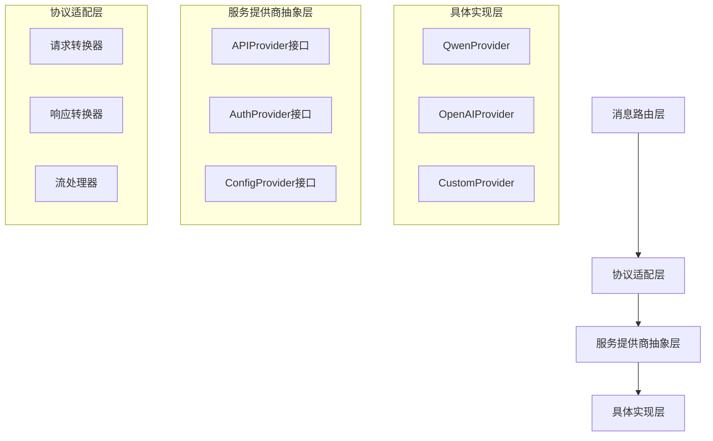
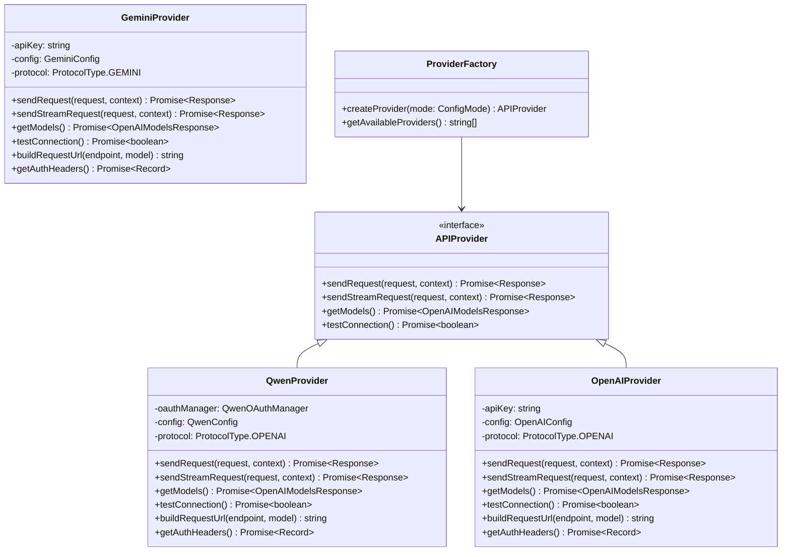
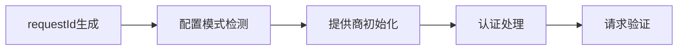

# 消息路由模块重构设计

## 概述

消息路由模块(`src/routes/messages.ts`)当前硬编码了Qwen特定的实现，包括变量命名、URL构造和OAuth处理。本次重构的目标是将其改造为通用的OpenAI兼容架构，同时保持对现有Qwen模式的支持，并为未来支持其他协议提供扩展性。

## 当前问题分析

### 1. 硬编码Qwen特定实现
- 变量命名使用`qwenAccessToken`、`qwenBaseUrl`等Qwen特定前缀
- URL构造硬编码`/v1/chat/completions`，无法适配其他协议（如Gemini的`/v1beta/models/{model}:generateContent`）
- OAuth中间件直接调用`qwenOAuthManager`
- 日志中包含大量Qwen特定术语
- 缺乏协议适配层，无法支持不同API协议的端点结构

### 2. 架构耦合问题
- 消息路由与特定的OAuth实现紧耦合
- 缺乏统一的API客户端抽象
- 配置模式切换逻辑分散在多个组件中

### 3. 可扩展性限制
- 难以支持其他OpenAI兼容的API提供商
- 缺乏统一的错误处理机制
- 流式响应处理逻辑与Qwen强绑定

## 重构架构设计

### 1. 抽象层次划分



### 2. 核心接口设计

#### APIProvider接口
```typescript
interface APIProvider {
  name: string;
  protocol: ProtocolType; // 'openai' | 'gemini' | 'anthropic' | 'custom'
  sendRequest(request: OpenAIRequest, context: ConversionContext): Promise<Response>;
  sendStreamRequest(request: OpenAIRequest, context: ConversionContext): Promise<Response>;
  getModels(): Promise<OpenAIModelsResponse>;
  testConnection(): Promise<boolean>;
  buildRequestUrl(endpoint: APIEndpoint, model?: string): string;
  getAuthHeaders(): Promise<Record<string, string>>;
}

interface APIEndpoint {
  type: 'chat' | 'models' | 'health' | 'custom';
  method: 'GET' | 'POST' | 'PUT' | 'DELETE';
  path?: string; // 自定义路径
}

enum ProtocolType {
  OPENAI = 'openai',
  GEMINI = 'gemini', 
  ANTHROPIC = 'anthropic',
  CUSTOM = 'custom'
}
```

#### AuthProvider接口
```typescript
interface AuthProvider {
  getAuthHeaders(): Promise<Record<string, string>>;
  isValid(): Promise<boolean>;
  refresh?(): Promise<void>;
}
```

#### ConfigProvider接口
```typescript
interface ConfigProvider {
  getBaseUrl(): string;
  getApiKey(): string;
  getTimeout(): number;
  getMaxRetries(): number;
}
```

### 3. 提供商实现架构



## URL构造与协议适配设计

### 1. 协议端点差异分析

不同的API协议有着完全不同的端点结构和URL构造方式：

#### OpenAI/Qwen协议（兼容OpenAI）
```
GET  /v1/models                    # 获取模型列表
POST /v1/chat/completions          # 聊天完成
POST /v1/embeddings               # 文本嵌入
```

#### Gemini协议
```
GET  /v1beta/models                           # 获取模型列表
POST /v1beta/models/{model}:generateContent   # 内容生成（需要模型名称）
POST /v1beta/models/{model}:streamGenerateContent  # 流式生成
```

#### Anthropic协议
```
GET  /v1/models                    # 获取模型列表
POST /v1/messages                  # 消息处理
POST /v1/messages/stream          # 流式消息
```

### 2. 协议适配器架构

```mermaid
graph TD
    A[统一请求接口] --> B[协议适配器]
    B --> C[OpenAI适配器]
    B --> D[Gemini适配器]
    B --> E[Anthropic适配器]
    
    C --> F[OpenAI端点]
    D --> G[Gemini端点]
    E --> H[Anthropic端点]
    
    F --> I[/v1/chat/completions]
    G --> J[/v1beta/models/model:generateContent]
    H --> K[/v1/messages]
```

### 3. URL构造抽象实现

#### 协议端点配置
```typescript
// src/providers/base/protocol-endpoints.ts
export interface EndpointTemplate {
  path: string;
  method: HttpMethod;
  requiresModel?: boolean;
  modelPlacement?: 'path' | 'query' | 'body';
  pathVariables?: string[];
}

export const PROTOCOL_ENDPOINTS = {
  [ProtocolType.OPENAI]: {
    chat: {
      path: '/v1/chat/completions',
      method: 'POST'
    },
    models: {
      path: '/v1/models',
      method: 'GET'
    }
  },
  [ProtocolType.GEMINI]: {
    chat: {
      path: '/v1beta/models/{model}:generateContent',
      method: 'POST',
      requiresModel: true,
      modelPlacement: 'path',
      pathVariables: ['model']
    },
    models: {
      path: '/v1beta/models',
      method: 'GET'
    },
    streamChat: {
      path: '/v1beta/models/{model}:streamGenerateContent',
      method: 'POST',
      requiresModel: true,
      modelPlacement: 'path'
    }
  },
  [ProtocolType.ANTHROPIC]: {
    chat: {
      path: '/v1/messages',
      method: 'POST'
    },
    models: {
      path: '/v1/models',
      method: 'GET'
    }
  }
} as const;
```

#### 智能URL构造器
```typescript
// src/providers/base/url-builder.ts
export class URLBuilder {
  static buildURL(
    baseUrl: string, 
    endpoint: EndpointTemplate, 
    options: {
      model?: string;
      pathParams?: Record<string, string>;
      queryParams?: Record<string, string>;
    } = {}
  ): string {
    let path = endpoint.path;
    
    // 处理路径变量替换
    if (endpoint.pathVariables) {
      for (const variable of endpoint.pathVariables) {
        const value = options.pathParams?.[variable] || options.model;
        if (value && path.includes(`{${variable}}`)) {
          path = path.replace(`{${variable}}`, encodeURIComponent(value));
        }
      }
    }
    
    // 验证必需的模型参数
    if (endpoint.requiresModel && !options.model) {
      throw new Error(`Endpoint requires model parameter: ${endpoint.path}`);
    }
    
    // 构造完整URL
    const normalizedBaseUrl = baseUrl.replace(/\/$/, '');
    const normalizedPath = path.replace(/^\//, '');
    let fullUrl = `${normalizedBaseUrl}/${normalizedPath}`;
    
    // 添加查询参数
    if (options.queryParams && Object.keys(options.queryParams).length > 0) {
      const queryString = new URLSearchParams(options.queryParams).toString();
      fullUrl += `?${queryString}`;
    }
    
    return fullUrl;
  }
  
  static validateURL(url: string): boolean {
    try {
      new URL(url);
      return true;
    } catch {
      return false;
    }
  }
}
```

#### 新的请求处理流程
```mermaid
#### 新的请求处理流程
```mermaid
    participant Client as 客户端
    participant Router as 消息路由
    participant Factory as 提供商工厂
    participant Provider as API提供商
    participant Converter as 协议转换器
    
    Client->>Router: POST /v1/messages
    Router->>Router: 生成请求ID & 验证
    Router->>Factory: 获取当前提供商
    Factory->>Provider: 创建提供商实例
    Router->>Converter: 转换请求格式
    Router->>Provider: 发送请求
    Provider->>Provider: 处理认证 & 发送
    Provider-->>Router: 返回响应
    Router->>Converter: 转换响应格式
    Router-->>Client: 返回最终响应
```

#### 中间件重构


## 详细实现计划

### 1. 提供商抽象层实现

#### 文件结构
```
src/
├── providers/
│   ├── base/
│   │   ├── api-provider.interface.ts
│   │   ├── auth-provider.interface.ts
│   │   └── config-provider.interface.ts
│   ├── qwen/
│   │   ├── qwen-provider.ts
│   │   ├── qwen-auth-provider.ts
│   │   └── qwen-config-provider.ts
│   ├── openai/
│   │   ├── openai-provider.ts
│   │   ├── openai-auth-provider.ts
│   │   └── openai-config-provider.ts
│   ├── factory/
│   │   └── provider-factory.ts
│   └── index.ts
```

#### 核心接口定义
```typescript
// src/providers/base/api-provider.interface.ts
export interface APIProvider {
  readonly name: string;
  readonly version: string;
  readonly protocol: ProtocolType;
  
  sendRequest(
    request: OpenAIRequest, 
    context: ConversionContext
  ): Promise<Response>;
  
  sendStreamRequest(
    request: OpenAIRequest, 
    context: ConversionContext
  ): Promise<Response>;
  
  getModels(): Promise<OpenAIModelsResponse>;
  testConnection(): Promise<ProviderHealthStatus>;
  getCapabilities(): ProviderCapabilities;
  
  // URL构造相关方法
  buildRequestUrl(endpoint: APIEndpoint, model?: string): string;
  getAuthHeaders(): Promise<Record<string, string>>;
  
  // 协议特定的转换方法
  adaptRequest?(request: OpenAIRequest): any;
  adaptResponse?(response: any): OpenAIResponse;
}

export interface APIEndpoint {
  type: 'chat' | 'models' | 'health' | 'embeddings' | 'custom';
  method: 'GET' | 'POST' | 'PUT' | 'DELETE';
  path?: string; // 自定义路径模板
  requiresModel?: boolean; // 是否需要模型参数
}

export enum ProtocolType {
  OPENAI = 'openai',
  GEMINI = 'gemini',
  ANTHROPIC = 'anthropic', 
  CLAUDE = 'claude',
  CUSTOM = 'custom'
}

// 协议特定的端点配置
export interface ProtocolEndpoints {
  chat: APIEndpoint;
  models: APIEndpoint;
  health?: APIEndpoint;
  embeddings?: APIEndpoint;
  custom?: Record<string, APIEndpoint>;
}

export interface ProviderHealthStatus {
  isHealthy: boolean;
  responseTime: number;
  error?: string;
  details?: Record<string, any>;
}

export interface ProviderCapabilities {
  supportsStreaming: boolean;
  supportsTools: boolean;
  supportsVision: boolean;
  supportedModels: string[];
  maxTokens: number;
  maxContextLength: number;
  protocolVersion: string;
}
```

### 2. 协议适配器设计

#### 不同协议的端点结构对比
```typescript
// OpenAI/Qwen协议 (兼容OpenAI)
const OPENAI_ENDPOINTS: ProtocolEndpoints = {
  chat: {
    type: 'chat',
    method: 'POST',
    path: '/v1/chat/completions'
  },
  models: {
    type: 'models', 
    method: 'GET',
    path: '/v1/models'
  }
};

// Gemini协议
const GEMINI_ENDPOINTS: ProtocolEndpoints = {
  chat: {
    type: 'chat',
    method: 'POST',
    path: '/v1beta/models/{model}:generateContent',
    requiresModel: true
  },
  models: {
    type: 'models',
    method: 'GET', 
    path: '/v1beta/models'
  }
};

// Anthropic协议
const ANTHROPIC_ENDPOINTS: ProtocolEndpoints = {
  chat: {
    type: 'chat',
    method: 'POST',
    path: '/v1/messages'
  },
  models: {
    type: 'models',
    method: 'GET',
    path: '/v1/models'
  }
};
```

#### URL构造抽象基类
```typescript
// src/providers/base/base-provider.ts
export abstract class BaseProvider implements APIProvider {
  protected abstract endpoints: ProtocolEndpoints;
  protected abstract baseUrl: string;
  
  buildRequestUrl(endpoint: APIEndpoint, model?: string): string {
    let path = endpoint.path || '';
    
    // 处理路径模板变量
    if (endpoint.requiresModel && model) {
      path = path.replace('{model}', encodeURIComponent(model));
    }
    
    // 移除双斜杠并标准化URL
    const normalizedBaseUrl = this.baseUrl.replace(/\/$/, '');
    const normalizedPath = path.replace(/^\//, '');
    
    return `${normalizedBaseUrl}/${normalizedPath}`;
  }
  
  protected getEndpoint(type: keyof ProtocolEndpoints): APIEndpoint {
    const endpoint = this.endpoints[type];
    if (!endpoint) {
      throw new Error(`Endpoint '${type}' not supported by ${this.protocol} protocol`);
    }
    return endpoint;
  }
  
  abstract get protocol(): ProtocolType;
  abstract getAuthHeaders(): Promise<Record<string, string>>;
}
```

### 4. 提供商工厂模式

#### 智能提供商工厂
```typescript
// src/providers/factory/provider-factory.ts
export class ProviderFactory {
  private static providers = new Map<ConfigMode, () => APIProvider>();
  
  static {
    // 注册提供商构造函数
    this.registerProvider(ConfigMode.QWEN_CLI, () => {
      return new QwenProvider(
        qwenOAuthManager,
        configManager.getConfig().qwen
      );
    });
    
    this.registerProvider(ConfigMode.UNIVERSAL_OPENAI, () => {
      const config = configManager.getConfig().openai;
      return new OpenAIProvider(config.apiKey, config.baseUrl);
    });
    
    // 未来可以添加更多提供商
    // this.registerProvider(ConfigMode.GEMINI, () => {
    //   return new GeminiProvider(
    //     process.env.GEMINI_API_KEY!,
    //     'https://generativelanguage.googleapis.com'
    //   );
    // });
  }
  
  static registerProvider(
    mode: ConfigMode, 
    factory: () => APIProvider
  ): void {
    this.providers.set(mode, factory);
  }
  
  static createProvider(mode: ConfigMode): APIProvider {
    const factory = this.providers.get(mode);
    if (!factory) {
      throw new Error(`No provider registered for config mode: ${mode}`);
    }
    
    const provider = factory();
    
    logger.debug('Provider created', {
      mode,
      providerName: provider.name,
      protocol: provider.protocol,
      version: provider.version
    });
    
    return provider;
  }
  
  static getAvailableProviders(): string[] {
    return Array.from(this.providers.keys());
  }
  
  static getSupportedProtocols(): ProtocolType[] {
    const protocols = new Set<ProtocolType>();
    
    for (const factory of this.providers.values()) {
      try {
        const provider = factory();
        protocols.add(provider.protocol);
      } catch (error) {
        // 忽略创建失败的提供商
      }
    }
    
    return Array.from(protocols);
  }
}
```
#### 重构后的消息路由
```typescript
// src/routes/messages.ts (重构后)
import express, { Request, Response } from 'express';
import { logger, generateRequestId, MessageLogger } from '../utils/helpers';
import { configManager } from '../config';
import { providerMiddleware } from '../middleware/provider';
import { anthropicToOpenAIConverter } from '../converters/anthropic-to-openai';
import { openaiToAnthropicResponseConverter } from '../converters/openai-to-anthropic-response';
import { StreamProcessor } from '../processors/stream-processor';
import { MessageErrorHandler } from '../handlers/error-handler';
import type { ConversionContext, APIProvider } from '../types';

const router = express.Router();
const streamProcessor = new StreamProcessor();

// 中间件：生成请求ID
router.use((req: Request, res: Response, next) => {
  req.requestId = generateRequestId();
  next();
});

// 中间件：初始化API提供商
router.use(providerMiddleware.initializeProvider);

// 中间件：确保提供商认证
router.use(providerMiddleware.ensureAuthentication);

// POST /v1/messages - 主要的消息处理端点
router.post('/', async (req: Request, res: Response) => {
  const requestId = req.requestId!;
  const startTime = Date.now();
  const provider = req.apiProvider as APIProvider;
  
  try {
    // 记录请求开始（使用通用日志）
    MessageLogger.logRequestStart(
      requestId, 
      'POST', 
      '/v1/messages', 
      req.body.model,
      provider
    );
    
    // 验证请求格式
    const validation = anthropicToOpenAIConverter.validateRequest(req.body);
    if (!validation.isValid) {
      return MessageErrorHandler.handleValidationError(res, validation, requestId);
    }
    
    // 保存原始模型信息
    req.originalModel = req.body.model;
    
    // 转换Anthropic请求到OpenAI格式
    const openaiRequest = anthropicToOpenAIConverter.convertRequest(req.body, requestId);
    
    // 构建转换上下文
    const context: ConversionContext = {
      requestId,
      originalModel: req.body.model,
      configMode: req.configMode!,
      timestamp: new Date().toISOString()
    };
    
    // 记录提供商请求
    MessageLogger.logProviderRequest(requestId, provider, openaiRequest);
    
    // 发送请求到API提供商
    const apiResponse = await provider.sendRequest(openaiRequest, context);
    
    if (!apiResponse.ok) {
      const errorText = await apiResponse.text();
      logger.error('Provider API request failed', {
        requestId,
        provider: provider.name,
        protocol: provider.protocol,
        status: apiResponse.status,
        statusText: apiResponse.statusText,
        error: errorText
      });
      
      return res.status(apiResponse.status).json({
        type: 'error',
        error: {
          type: 'api_error',
          message: `${provider.name} API error: ${apiResponse.status} ${apiResponse.statusText}`
        }
      });
    }
    
    // 处理流式响应
    if (openaiRequest.stream) {
      return streamProcessor.processStreamResponse(
        apiResponse,
        provider,
        req,
        res,
        requestId,
        startTime
      );
    }
    
    // 处理普通响应
    const responseData = await apiResponse.json();
    
    // 如果提供商有响应适配器，则使用它
    const adaptedResponse = provider.adaptResponse 
      ? provider.adaptResponse(responseData)
      : responseData;
    
    MessageLogger.logProviderResponse(requestId, provider, adaptedResponse);
    
    // 转换OpenAI响应到Anthropic格式
    const anthropicResponse = openaiToAnthropicResponseConverter.convertResponse(
      adaptedResponse,
      req.originalModel!,
      requestId
    );
    
    // 记录请求完成
    const duration = Date.now() - startTime;
    MessageLogger.logRequestEnd(
      requestId, 
      200, 
      duration, 
      {
        input: anthropicResponse.usage.input_tokens,
        output: anthropicResponse.usage.output_tokens
      },
      provider
    );
    
    // 返回转换后的响应
    res.json(anthropicResponse);
    
  } catch (error) {
    return MessageErrorHandler.handleProviderError(
      error,
      provider,
      req,
      res,
      requestId,
      startTime
    );
  }
});

export default router;
```

#### 提供商中间件设计
```typescript
// src/middleware/provider.ts
export class ProviderMiddleware {
  async initializeProvider(req: Request, res: Response, next: NextFunction): Promise<void> {
    const requestId = req.requestId || 'unknown';
    
    try {
      // 获取配置模式
      const configMode = configManager.getConfigMode();
      req.configMode = configMode;
      
      // 通过工厂创建提供商
      const provider = ProviderFactory.createProvider(configMode);
      req.apiProvider = provider;
      
      logger.debug('Provider initialized', {
        requestId,
        providerName: provider.name,
        configMode
      });
      
      next();
    } catch (error) {
      logger.error('Failed to initialize provider', {
        requestId,
        error: error instanceof Error ? error.message : String(error)
      });
      
      res.status(500).json({
        type: 'error',
        error: {
          type: 'configuration_error',
          message: 'Failed to initialize API provider'
        }
      });
    }
  }
  
  async ensureAuthentication(req: Request, res: Response, next: NextFunction): Promise<void> {
    const requestId = req.requestId || 'unknown';
    const provider = req.apiProvider as APIProvider;
    
    try {
      // 测试提供商连接
      const healthStatus = await provider.testConnection();
      
      if (!healthStatus.isHealthy) {
        throw new Error(`Provider connection failed: ${healthStatus.error}`);
      }
      
      req.providerHealth = healthStatus;
      
      logger.debug('Provider authentication successful', {
        requestId,
        providerName: provider.name,
        responseTime: healthStatus.responseTime
      });
      
      next();
    } catch (error) {
      logger.error('Provider authentication failed', {
        requestId,
        providerName: provider.name,
        error: error instanceof Error ? error.message : String(error)
      });
      
      res.status(401).json({
        type: 'error',
        error: {
          type: 'authentication_error',
          message: 'API provider authentication failed'
        }
      });
    }
  }
}
```

### 3. 流式响应处理重构

#### 通用流处理器设计
```typescript
// src/processors/stream-processor.ts
export class StreamProcessor {
  async processStreamResponse(
    apiResponse: Response,
    provider: APIProvider,
    req: Request,
    res: Response,
    requestId: string,
    startTime: number
  ): Promise<void> {
    try {
      logger.info('Starting stream response processing', { 
        requestId, 
        provider: provider.name 
      });
      
      // 设置SSE响应头
      this.setupStreamHeaders(res);
      
      const reader = apiResponse.body?.getReader();
      if (!reader) {
        throw new Error('No readable stream available');
      }
      
      const decoder = new TextDecoder();
      let isFirstChunk = true;
      let totalOutputTokens = 0;
      let buffer = '';
      
      try {
        while (true) {
          if (this.isConnectionClosed(res)) {
            logger.info('Client disconnected during stream', { requestId });
            reader.cancel();
            break;
          }
          
          const { done, value } = await reader.read();
          if (done) break;
          
          const chunk = decoder.decode(value, { stream: true });
          buffer += chunk;
          
          // 处理完整的数据行
          const processedTokens = await this.processChunkBuffer(
            buffer, 
            req, 
            res, 
            requestId, 
            isFirstChunk
          );
          
          totalOutputTokens += processedTokens;
          isFirstChunk = false;
          
          // 重置缓冲区
          buffer = this.getIncompleteBuffer(buffer);
        }
        
        // 处理剩余缓冲区
        if (buffer.trim()) {
          await this.processRemainingBuffer(buffer, req, res, requestId);
        }
        
      } finally {
        this.cleanupReader(reader);
      }
      
      // 记录完成状态
      this.logStreamCompletion(requestId, startTime, totalOutputTokens);
      
      // 确保连接正常关闭
      this.closeConnection(res);
      
    } catch (error) {
      this.handleStreamError(error, req, res, requestId, startTime);
    }
  }
  
  private setupStreamHeaders(res: Response): void {
    res.writeHead(200, {
      'Content-Type': 'text/event-stream',
      'Cache-Control': 'no-cache',
      'Connection': 'keep-alive',
      'Access-Control-Allow-Origin': '*',
      'Access-Control-Allow-Headers': 'Cache-Control',
      'X-Accel-Buffering': 'no',
      'Transfer-Encoding': 'chunked'
    });
    
    // 发送初始连接确认
    res.write('event: connected\ndata: {"type": "ping"}\n\n');
  }
  
  private async processChunkBuffer(
    buffer: string,
    req: Request,
    res: Response,
    requestId: string,
    isFirstChunk: boolean
  ): Promise<number> {
    const lines = buffer.split('\n');
    let processedTokens = 0;
    
    for (const line of lines) {
      if (!line.startsWith('data: ')) continue;
      
      const data = line.slice(6).trim();
      if (!data || data === '[DONE]') {
        if (data === '[DONE]') {
          res.write('data: [DONE]\n\n');
        }
        continue;
      }
      
      try {
        const chunk = JSON.parse(data);
        
        // 使用通用转换器处理流式块
        const anthropicChunks = openaiToAnthropicResponseConverter.convertStreamChunk(
          chunk,
          req.originalModel!,
          requestId,
          isFirstChunk
        );
        
        // 发送转换后的块
        for (const anthropicChunk of anthropicChunks) {
          res.write(anthropicChunk);
        }
        
        // 统计token使用量
        if (chunk.usage?.completion_tokens) {
          processedTokens = chunk.usage.completion_tokens;
        }
        
      } catch (parseError) {
        logger.warn('Failed to parse stream chunk', {
          requestId,
          chunk: data.substring(0, 200),
          error: parseError instanceof Error ? parseError.message : String(parseError)
        });
      }
    }
    
    return processedTokens;
  }
}
```

### 6. 配置模式适配器

#### 协议特定的认证机制
不同的API提供商具有不同的认证方式：

- **Qwen**: OAuth2动态token，需要定期刷新
- **OpenAI**: 静态API Key，使用Bearer token
- **Gemini**: Google API Key，使用x-goog-api-key头
- **Anthropic**: API Key，使用x-api-key头

#### 通用认证适配器
```typescript
// src/providers/base/auth-adapter.ts
export abstract class AuthAdapter {
  abstract getAuthHeaders(): Promise<Record<string, string>>;
  abstract isValid(): Promise<boolean>;
  abstract refresh?(): Promise<void>;
}

// Qwen OAuth适配器
export class QwenOAuthAdapter extends AuthAdapter {
  constructor(private oauthManager: QwenOAuthManager) {
    super();
  }
  
  async getAuthHeaders(): Promise<Record<string, string>> {
    const token = await this.oauthManager.getValidAccessToken();
    return {
      'Authorization': `Bearer ${token}`,
      'Content-Type': 'application/json'
    };
  }
  
  async isValid(): Promise<boolean> {
    try {
      await this.oauthManager.getValidAccessToken();
      return true;
    } catch {
      return false;
    }
  }
  
  async refresh(): Promise<void> {
    await this.oauthManager.refreshToken();
  }
}

// 通用API Key适配器
export class APIKeyAdapter extends AuthAdapter {
  constructor(
    private apiKey: string,
    private headerName: string = 'Authorization',
    private prefix: string = 'Bearer'
  ) {
    super();
  }
  
  async getAuthHeaders(): Promise<Record<string, string>> {
    const headerValue = this.prefix ? `${this.prefix} ${this.apiKey}` : this.apiKey;
    return {
      [this.headerName]: headerValue,
      'Content-Type': 'application/json'
    };
  }
  
  async isValid(): Promise<boolean> {
    return !!this.apiKey && this.apiKey.length > 0;
  }
}

// Gemini特定适配器
export class GeminiAuthAdapter extends APIKeyAdapter {
  constructor(apiKey: string) {
    super(apiKey, 'x-goog-api-key', ''); // 无前缀
  }
}
```

### 7. 协议扩展示例
```typescript
// src/types/request-extensions.ts
declare global {
  namespace Express {
    interface Request {
      // 通用属性
      requestId?: string;
      configMode?: ConfigMode;
      apiProvider?: APIProvider;
      providerHealth?: ProviderHealthStatus;
      originalModel?: string;
      
      // 认证相关
      authenticated?: boolean;
      authToken?: string;
      
      // 向后兼容的Qwen特定属性（标记为deprecated）
      /** @deprecated 使用 apiProvider 替代 */
      qwenAccessToken?: string;
      /** @deprecated 使用 apiProvider 替代 */
      qwenBaseUrl?: string;
    }
  }
}
```

### 5. 错误处理统一化

#### 通用错误处理器
```typescript
// src/handlers/error-handler.ts
export class MessageErrorHandler {
  static handleValidationError(
    res: Response, 
    validation: ValidationResult, 
    requestId: string
  ): void {
    logger.warn('Request validation failed', {
      requestId,
      errors: validation.errors
    });
    
    res.status(400).json({
      type: 'error',
      error: {
        type: 'invalid_request_error',
        message: `Invalid request: ${validation.errors.join(', ')}`
      }
    });
  }
  
  static handleProviderError(
    error: any,
    provider: APIProvider,
    req: Request,
    res: Response,
    requestId: string,
    startTime: number
  ): void {
    const duration = Date.now() - startTime;
    
    logger.error('Provider request failed', {
      requestId,
      provider: provider.name,
      duration,
      error: error instanceof Error ? error.message : String(error),
      stack: error instanceof Error ? error.stack : undefined
    });
    
    logRequestEnd(requestId, 500, duration);
    
    // 根据错误类型返回适当的状态码
    const statusCode = this.getErrorStatusCode(error);
    const errorType = this.getErrorType(error);
    
    res.status(statusCode).json({
      type: 'error',
      error: {
        type: errorType,
        message: this.getErrorMessage(error, provider.name)
      }
    });
  }
  
  private static getErrorStatusCode(error: any): number {
    if (error.status) return error.status;
    if (error.response?.status) return error.response.status;
    return 500;
  }
  
  private static getErrorType(error: any): string {
    if (error.status === 401) return 'authentication_error';
    if (error.status === 429) return 'rate_limit_error';
    if (error.status >= 400 && error.status < 500) return 'invalid_request_error';
    return 'api_error';
  }
  
  private static getErrorMessage(error: any, providerName: string): string {
    const baseMessage = error instanceof Error ? error.message : String(error);
    return `${providerName} API error: ${baseMessage}`;
  }
}
```

### 6. 日志系统优化

#### 通用日志标准化
```typescript
// src/utils/logging.ts
export class MessageLogger {
  static logRequestStart(
    requestId: string,
    method: string,
    path: string,
    model: string,
    provider?: APIProvider
  ): void {
    logger.info('Message request started', {
      requestId,
      method,
      path,
      requestedModel: model,
      provider: provider?.name || 'unknown',
      timestamp: new Date().toISOString()
    });
  }
  
  static logProviderRequest(
    requestId: string,
    provider: APIProvider,
    request: OpenAIRequest
  ): void {
    logger.debug('Sending request to provider', {
      requestId,
      provider: provider.name,
      model: request.model,
      messageCount: request.messages.length,
      stream: request.stream,
      hasTools: !!request.tools?.length
    });
  }
  
  static logProviderResponse(
    requestId: string,
    provider: APIProvider,
    responseData: any
  ): void {
    logger.debug('Received response from provider', {
      requestId,
      provider: provider.name,
      responseId: responseData.id,
      model: responseData.model,
      usage: responseData.usage
    });
  }
  
  static logRequestEnd(
    requestId: string,
    statusCode: number,
    duration: number,
    tokens?: { input: number; output: number },
    provider?: APIProvider
  ): void {
    logger.info('Message request completed', {
      requestId,
      statusCode,
      duration,
      provider: provider?.name || 'unknown',
      tokens,
      timestamp: new Date().toISOString()
    });
  }
}
```

## 迁移策略

### 1. 阶段性迁移计划

#### 第一阶段：基础抽象层
1. 创建提供商接口定义
2. 实现QwenProvider包装现有逻辑
3. 创建ProviderFactory基础实现
4. 添加向后兼容的中间件

#### 第二阶段：消息路由重构
1. 重构主要的消息处理函数
2. 替换Qwen特定的变量命名
3. 统一错误处理逻辑
4. 优化日志输出

#### 第三阶段：流处理优化
1. 抽象流处理逻辑
2. 实现通用StreamProcessor
3. 优化性能和错误处理

#### 第四阶段：扩展支持
1. 实现OpenAIProvider
2. 添加其他提供商支持
3. 完善测试覆盖

## 重构实施计划

### 第一阶段：协议抽象层（3-5天）
1. 创建协议端点配置和URL构造器
2. 实现BaseProvider抽象类
3. 创建认证适配器体系
4. 实现QwenProvider包装现有逻辑

### 第二阶段：消息路由重构（2-3天）
1. 重构主要的消息处理函数
2. 替换Qwen特定的变量命名和日志
3. 实现通用的提供商中间件
4. 统一错误处理和日志记录

### 第三阶段：流处理优化（2-3天）
1. 抽象流处理逻辑
2. 实现通用StreamProcessor
3. 支持协议特定的流处理
4. 优化性能和错误处理

### 第四阶段：扩展支持（3-5天）
1. 实现OpenAIProvider和GeminiProvider
2. 完善ProviderFactory和配置管理
3. 添加其他协议支持示例
4. 完善测试覆盖和文档

#### 配置兼容性
- 现有的环境变量和命令行参数保持不变
- Qwen OAuth配置文件路径不变
- 现有的模型映射配置格式兼容

#### API兼容性
- 所有现有的API端点保持不变
- 请求/响应格式完全兼容
- 错误响应格式保持一致

#### 行为兼容性
- Qwen模式下的行为完全不变
- 日志格式保持基本一致（术语更通用）
- 性能特征不会显著变化

## 测试策略

### 1. 单元测试覆盖

#### 提供商测试
```typescript
// tests/providers/qwen-provider.test.ts
describe('QwenProvider', () => {
  it('should maintain backward compatibility with existing Qwen logic', () => {
    // 测试现有逻辑是否正常工作
  });
  
  it('should implement APIProvider interface correctly', () => {
    // 测试接口实现的正确性
  });
  
  it('should handle authentication properly', () => {
    // 测试认证逻辑
  });
});
```

#### 消息路由测试
```typescript
// tests/routes/messages-refactored.test.ts
describe('Refactored Messages Route', () => {
  it('should work with Qwen provider in qwen-cli mode', () => {
    // 测试Qwen模式兼容性
  });
  
  it('should work with OpenAI provider in universal mode', () => {
    // 测试通用OpenAI模式
  });
  
  it('should handle provider switching correctly', () => {
    // 测试提供商切换
  });
});
```

### 2. 集成测试

#### 端到端测试
- 完整的请求/响应流程测试
- 流式响应处理测试
- 错误场景处理测试
- 配置模式切换测试

### 3. 回归测试

#### 现有功能验证
- 所有现有的测试用例必须继续通过
- 性能基准测试确保无显著退化
- 兼容性测试确保现有部署不受影响

## 性能考虑

### 1. 优化点

#### 提供商初始化
- 提供商实例缓存避免重复创建
- 延迟初始化减少启动时间
- 连接池复用减少网络开销

#### 流处理优化
- 减少不必要的字符串操作
- 优化缓冲区管理
- 改进错误处理路径

### 2. 监控指标

#### 关键性能指标
- 请求处理延迟
- 流式响应首字节时间
- 内存使用情况
- 提供商切换时间

## 扩展性设计

### 1. 新提供商添加

#### 标准化接口
- 遵循APIProvider接口规范
- 实现标准的认证流程
- 提供完整的错误处理

#### 配置集成
- 添加新的ConfigMode枚举值
- 扩展配置管理器支持
- 更新ProviderFactory

### 2. 协议扩展

#### 新协议支持
- 扩展转换器接口支持新格式
- 添加协议特定的处理逻辑
- 实现协议间的互转换

## 监控与维护

### 1. 日志标准化

#### 统一日志格式
- 标准化的请求追踪
- 提供商特定的上下文信息
- 性能指标记录

### 2. 健康检查增强

#### 提供商健康状态
- 实时连接状态监控
- 性能指标收集
- 故障自动检测和恢复

### 3. 配置热更新

#### 动态配置支持
- 提供商配置热更新
- 模型映射动态修改
- 无需重启的配置变更
