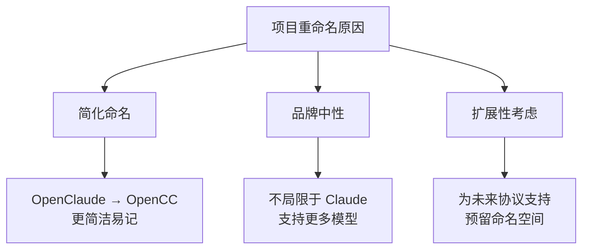
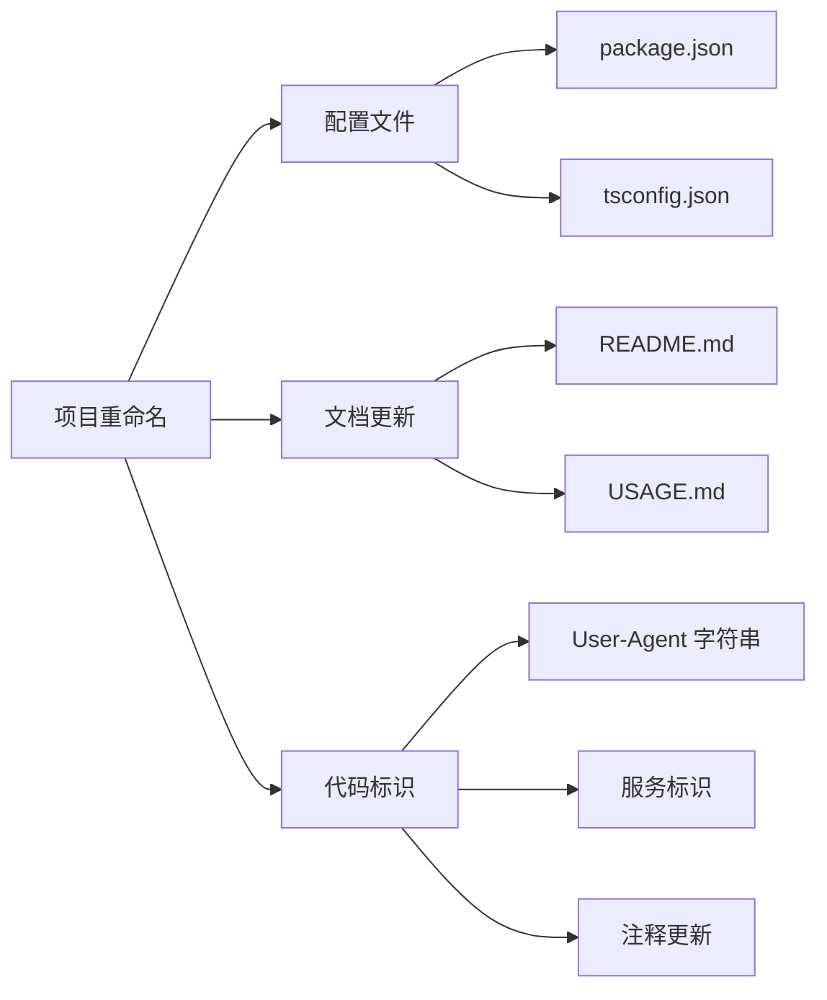
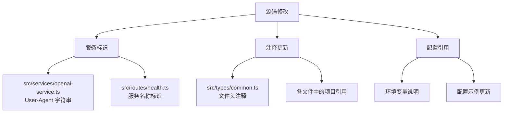
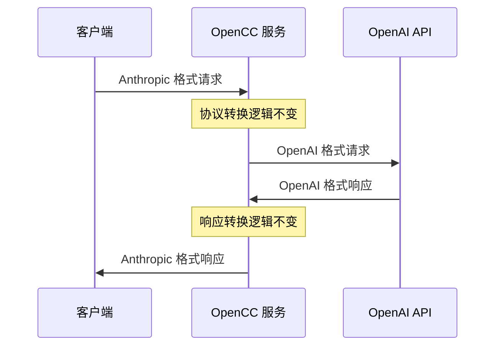
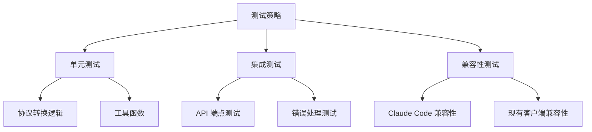
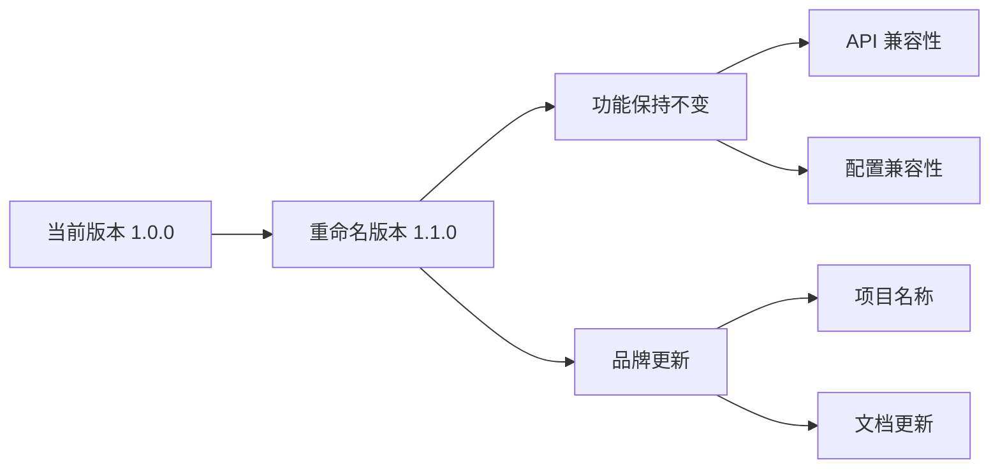
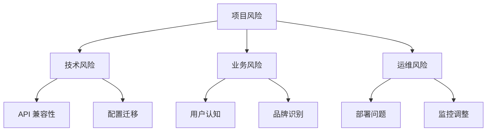
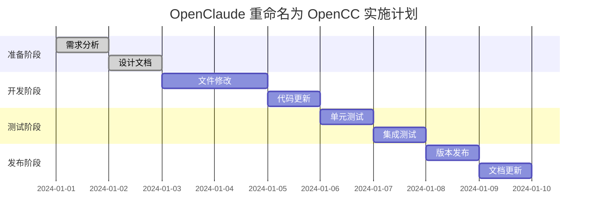

# OpenClaude 项目重命名为 OpenCC 设计文档

## 1. 概述

本设计文档描述了将 OpenClaude 项目重命名为 OpenCC 的完整实施方案。OpenCC 作为新的项目名称，保持了原有的协议转换功能，但提供了更简洁和通用的命名。

### 1.1 重命名目标

- **项目名称**: OpenClaude → OpenCC
- **包名称**: openclaude → opencc
- **品牌标识**: 从 Claude 专用转换器升级为通用协议转换器
- **功能保持**: 所有现有功能和 API 兼容性保持不变

### 1.2 重命名原因



## 2. 架构影响分析

### 2.1 系统组件影响评估

| 组件类型 | 影响程度 | 修改内容 |
|---------|---------|----------|
| 包配置文件 | 高 | package.json 中的项目信息 |
| 文档文件 | 高 | README.md, USAGE.md 等 |
| 代码注释 | 中 | 源码中的项目引用 |
| API 响应 | 中 | User-Agent 等标识信息 |
| 日志信息 | 低 | 服务标识字符串 |
| 核心功能 | 无 | API 协议转换逻辑不变 |

### 2.2 依赖关系分析



## 3. 文件修改清单

### 3.1 核心配置文件

#### package.json 修改项

| 字段 | 当前值 | 新值 |
|------|--------|------|
| name | "openclaude" | "opencc" |
| description | "OpenClaude - A protocol converter..." | "OpenCC - A protocol converter..." |
| author | "OpenClaude Team" | "OpenCC Team" |
| keywords | 包含 "claude" | 更新为通用关键词 |

#### README.md 主要修改

- 标题: "OpenClaude 协议转换器" → "OpenCC 协议转换器"
- 项目描述中的所有 "OpenClaude" 引用
- Git 仓库 URL 引用
- 品牌徽章和链接

### 3.2 源代码文件修改

#### 需要修改的文件类型



### 3.3 具体修改内容

#### src/services/openai-service.ts
```typescript
// 当前
'User-Agent': 'OpenClaude/1.0.0'

// 修改为
'User-Agent': 'OpenCC/1.0.0'
```

#### src/types/common.ts
```typescript
// 当前
* Common types and interfaces for OpenClaude

// 修改为
* Common types and interfaces for OpenCC
```

#### USAGE.md
```markdown
# 当前标题
Qwen API代理服务使用说明

# 建议修改为
OpenCC API 协议转换服务使用说明
```

## 4. 数据和配置管理

### 4.1 环境变量保持不变

现有的环境变量配置保持完全兼容：

| 变量名 | 状态 | 说明 |
|--------|------|------|
| OPENAI_API_KEY | 保持 | 核心功能配置 |
| PORT | 保持 | 服务端口配置 |
| NODE_ENV | 保持 | 环境配置 |
| 其他配置变量 | ✓ 全部保持 | 确保向后兼容 |

### 4.2 模型映射配置保持不变

```json
{
  "model_mappings": {
    "claude-3-opus-20240229": {
      "openai_model": "gpt-4-turbo-preview",
      "max_tokens": 4096,
      "context_window": 128000
    }
  }
}
```

**注意**: Claude 模型名称保持不变，因为这些是 Anthropic 的官方模型标识符。

## 5. API 兼容性保证

### 5.1 API 端点保持不变

| 端点 | 状态 | 说明 |
|------|------|------|
| `/v1/messages` | ✅ 保持 | 核心消息 API |
| `/v1/models` | ✅ 保持 | 模型列表 API |
| `/health` | ✅ 保持 | 健康检查 API |
| 认证机制 | ✅ 保持 | x-api-key 认证 |

### 5.2 响应格式兼容



## 6. 测试策略

### 6.1 回归测试要求



### 6.2 测试检查清单

- [ ] 所有现有单元测试通过
- [ ] API 响应格式保持一致
- [ ] 错误处理机制正常
- [ ] 流式响应功能正常
- [ ] 认证和授权机制正常
- [ ] 健康检查端点返回正确信息
- [ ] 日志格式和内容合理

## 7. 部署和发布

### 7.1 版本管理策略



### 7.2 发布步骤

1. **准备阶段**
   - 创建功能分支 `feature/rename-to-opencc`
   - 执行所有文件修改
   - 更新版本号到 1.1.0

2. **测试阶段**
   - 运行完整测试套件
   - 执行手动集成测试
   - 验证 Claude Code 兼容性

3. **发布阶段**
   - 合并到主分支
   - 创建发布标签 `v1.1.0`
   - 更新包注册信息

### 7.3 回滚计划

如果重命名后出现问题，提供快速回滚机制：

| 回滚类型 | 操作步骤 | 恢复时间 |
|----------|----------|----------|
| 代码回滚 | Git 回退到重命名前版本 | < 5 分钟 |
| 包名回滚 | 恢复 package.json 配置 | < 2 分钟 |
| 文档回滚 | 恢复文档文件内容 | < 1 分钟 |

## 8. 风险评估与缓解

### 8.1 风险识别



### 8.2 风险缓解措施

| 风险类型 | 风险等级 | 缓解措施 |
|----------|----------|----------|
| API 兼容性问题 | 低 | 全面回归测试 + 版本兼容保证 |
| 用户配置问题 | 低 | 保持所有环境变量不变 |
| 文档同步问题 | 中 | 建立文档检查清单 |
| 品牌认知混乱 | 中 | 提供清晰的迁移说明 |

## 9. 实施时间表

### 9.1 实施阶段



### 9.2 关键里程碑

- **Day 1**: 完成设计文档和修改计划
- **Day 3**: 完成所有文件修改
- **Day 4**: 完成代码标识更新
- **Day 6**: 完成所有测试验证
- **Day 7**: 正式发布 OpenCC v1.1.0

## 10. 成功标准

### 10.1 技术指标

- [ ] 所有现有 API 测试通过率 100%
- [ ] 协议转换功能零错误
- [ ] 性能指标保持不变
- [ ] 内存使用无显著增加

### 10.2 业务指标

- [ ] 现有用户零中断迁移
- [ ] 文档完整性 100%
- [ ] 配置兼容性 100%
- [ ] 品牌一致性达成

### 10.3 质量指标

- [ ] 代码质量保持现有标准
- [ ] 测试覆盖率不降低
- [ ] 安全性检查通过
- [ ] 性能基准测试通过

## 11. 后续维护计划

### 11.1 文档维护

- 定期检查所有文档中的品牌一致性
- 保持 API 文档的准确性和完整性
- 更新使用示例和最佳实践

### 11.2 社区沟通

- 向现有用户通知项目重命名
- 提供迁移指南和支持
- 更新相关的第三方文档引用

### 11.3 技术债务

- 清理遗留的旧命名引用
- 优化重命名后的代码结构
- 持续改进品牌一致性


