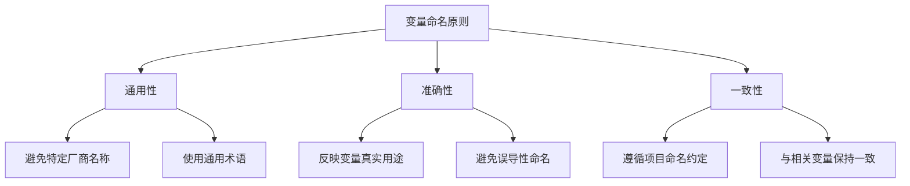

# OpenAI转Anthropic响应转换器变量重命名设计

## 1. 概述

### 任务目标
将 `openai-to-anthropic-response.ts` 文件中与 qwen 无关的命名修改为通用命名，提升代码的通用性和可读性。

### 背景
当前代码中存在一些特定于 qwen 的变量命名（如 `qwenModel`），但实际上这些变量在逻辑上是通用的，应该使用更通用的命名来提升代码的可维护性。

### 原则
- 只修改与 qwen 无关的命名为通用命名
- 保持代码功能完全不变
- 确保重命名后的变量名更准确地反映其用途
- 与 qwen 真正相关的逻辑和命名保持不变

## 2. 变量重命名分析

### 需要重命名的变量

#### 2.1 `qwenModel` → `responseModel`
**位置**: `convertResponse` 方法中的日志记录
**当前代码**:
```typescript
logger.info('Converting OpenAI response to Anthropic format', {
  requestId,
  originalModel,
  qwenModel: openaiResponse.model,  // 需要重命名
  inputTokens: openaiResponse.usage?.prompt_tokens || 0,
  outputTokens: openaiResponse.usage?.completion_tokens || 0,
  finishReason: choice.finish_reason,
  responseId: openaiResponse.id
});
```

**重命名理由**:
- `openaiResponse.model` 实际上是响应中返回的模型名称，不一定是 qwen 模型
- 在通用的协议转换器中，这个字段代表任何 OpenAI 兼容 API 返回的模型名称
- 使用 `responseModel` 更准确地描述这个变量的含义

**重命名后**:
```typescript
logger.info('Converting OpenAI response to Anthropic format', {
  requestId,
  originalModel,
  responseModel: openaiResponse.model,  // 更通用的命名
  inputTokens: openaiResponse.usage?.prompt_tokens || 0,
  outputTokens: openaiResponse.usage?.completion_tokens || 0,
  finishReason: choice.finish_reason,
  responseId: openaiResponse.id
});
```

### 不需要重命名的部分

经过仔细分析，代码中只有一处需要重命名的变量。其他所有变量命名都是通用的，如：
- `openaiResponse`、`openaiChunk` - 明确表示 OpenAI 格式的响应
- `anthropicResponse`、`anthropicMessageId` - 明确表示 Anthropic 格式
- `originalModel` - 表示客户端原始请求的模型
- `requestId`、`toolCallId` - 通用标识符
- 其他方法名和变量名都是通用的

## 3. 实施计划

### 3.1 代码修改
只需要修改一处：将第 25 行的 `qwenModel` 重命名为 `responseModel`

### 3.2 影响分析
- **功能影响**: 无，仅是变量名重命名
- **日志输出**: 日志中的字段名从 `qwenModel` 变为 `responseModel`
- **API 兼容性**: 无影响，不涉及外部接口
- **类型安全**: 无影响，类型保持不变

### 3.3 验证方法
- 确保代码编译无错误
- 运行现有测试确保功能未受影响
- 检查日志输出格式是否正确

## 4. 架构设计

### 4.1 变量命名规范


### 4.2 重命名映射
| 原变量名 | 新变量名 | 用途描述 | 重命名理由 |
|---------|----------|----------|-----------|
| `qwenModel` | `responseModel` | OpenAI 响应中的模型名称 | 更通用，不特指 qwen |

### 4.3 代码质量提升
- **可读性提升**: 变量名更准确地反映其含义
- **维护性提升**: 减少特定厂商相关的命名
- **扩展性提升**: 支持更多 OpenAI 兼容的 API 提供商

## 5. 测试策略

### 5.1 现有测试验证
- 运行 `anthropic-to-openai.test.ts` 相关测试
- 确保响应转换功能正常
- 验证日志输出格式

### 5.2 日志验证
确保重命名后的日志输出包含正确的字段：
```json
{
  "requestId": "req_xxx",
  "originalModel": "claude-3-sonnet",
  "responseModel": "qwen-plus",  // 新字段名
  "inputTokens": 100,
  "outputTokens": 50
}
```