# Tool Choice 自动设置功能设计

## 概述

本设计文档描述了在 OpenCC 协议转换器中实现 tool_choice 自动设置功能的技术方案。当请求中包含 tools 参数且不为 null 时，系统将自动设置 tool_choice 为 `{ "type": "auto" }`，确保工具调用功能的正确启用。

### 功能目标
- 当 `tools` 参数存在且不为空时，自动设置 `tool_choice` 为 auto 模式
- 保持现有 tool_choice 显式设置的优先级
- 确保协议转换的向后兼容性
- 提供清晰的日志记录以便调试

### 业务价值
- 简化用户使用工具调用的配置复杂度
- 减少因遗漏 tool_choice 设置导致的工具调用失败
- 提升 API 的易用性和开发者体验

## 技术架构

### 系统架构图

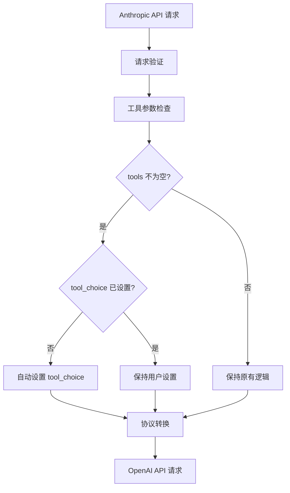

### 核心组件

#### 1. 请求预处理器 (Request Preprocessor)
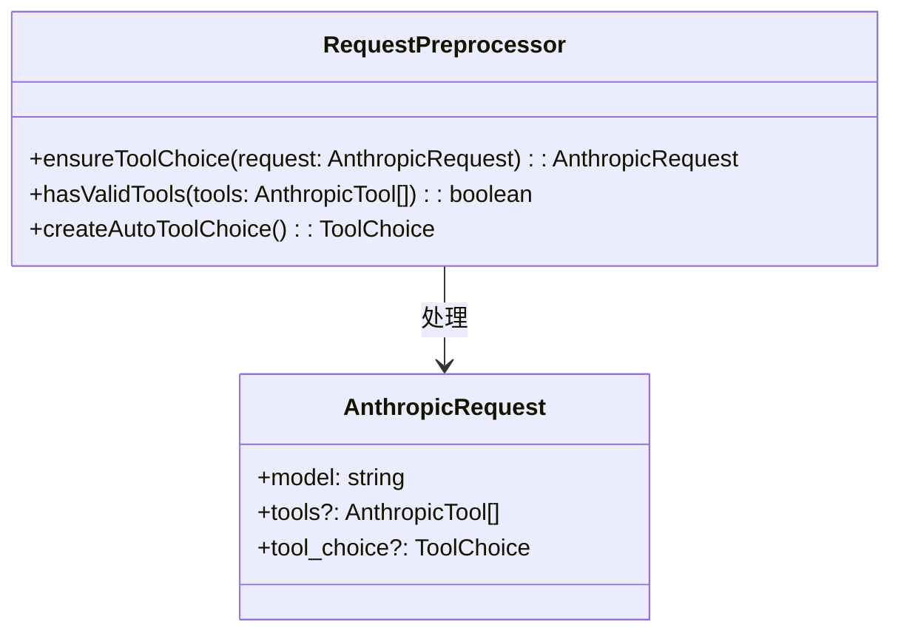

#### 2. 转换器增强 (Converter Enhancement)
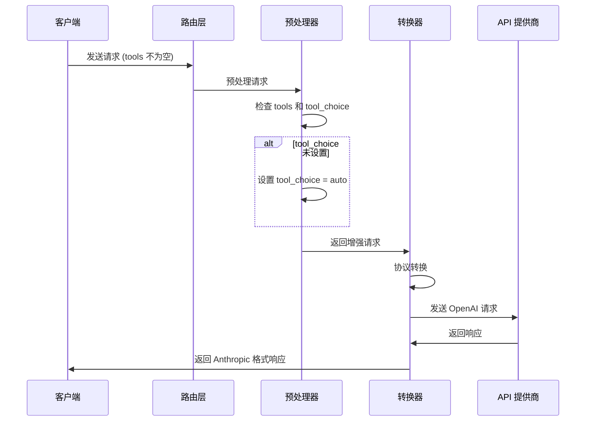

## 实现方案

### 修改点分析

#### 1. 核心转换器修改 (`anthropic-to-openai.ts`)

**修改位置**: `convertRequest` 方法
**修改内容**: 在协议转换前添加 tool_choice 自动设置逻辑

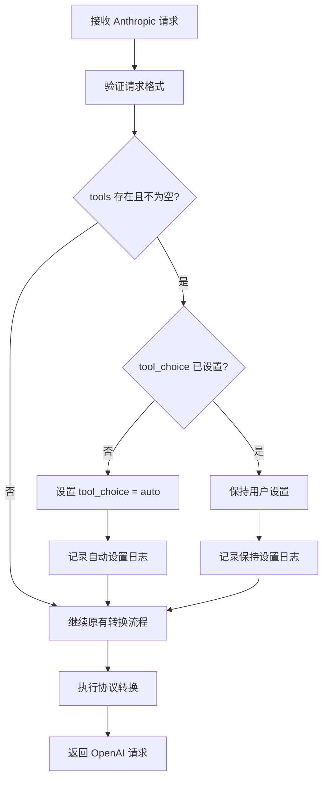

#### 2. 工具验证逻辑

**验证规则**:
- tools 数组不为 null 且不为 undefined
- tools 数组长度大于 0
- tools 数组中至少包含一个有效的工具定义

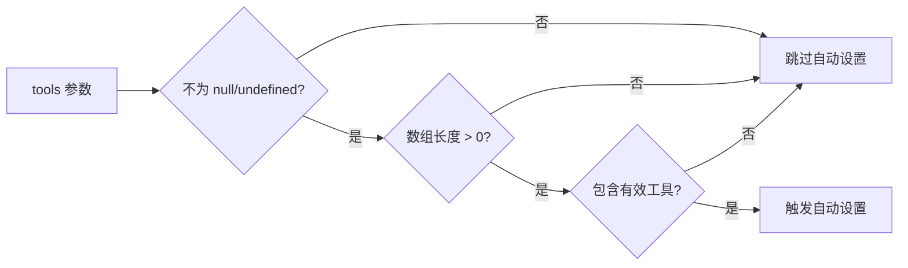

### 代码结构设计

#### 1. 新增工具函数

```typescript
// 位置: src/utils/helpers.ts 或 anthropic-to-openai.ts 内部
interface ToolChoiceAutoSetter {
  shouldAutoSetToolChoice(request: AnthropicRequest): boolean;
  setAutoToolChoice(request: AnthropicRequest): AnthropicRequest;
  validateTools(tools: AnthropicTool[]): boolean;
}
```

#### 2. 转换器方法扩展

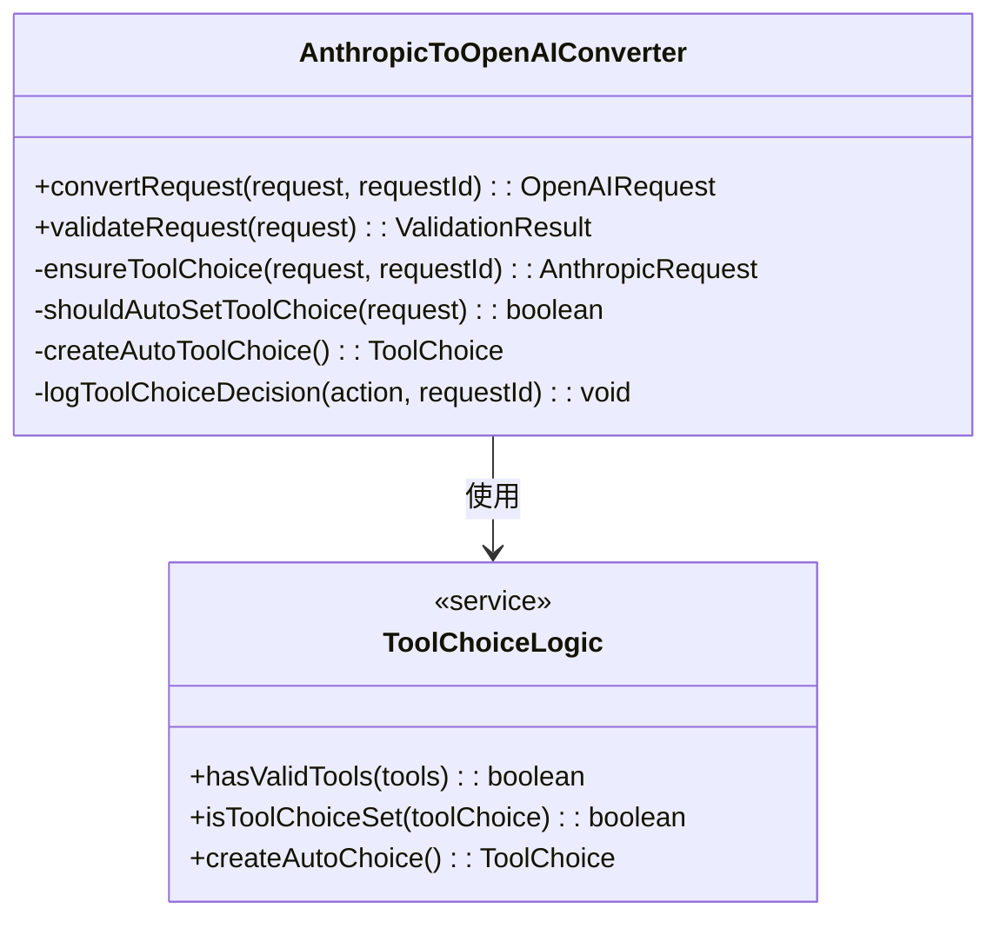

### 算法流程

#### 主要逻辑流程

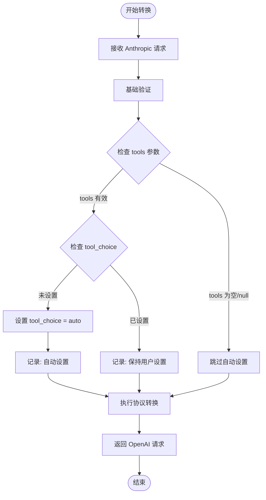

#### 工具验证算法

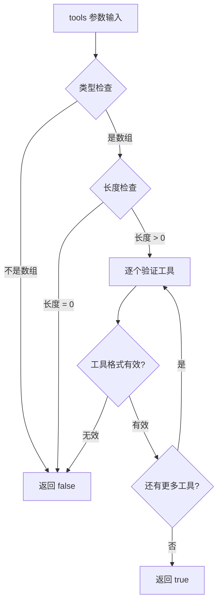

## 配置管理

### 功能开关设计

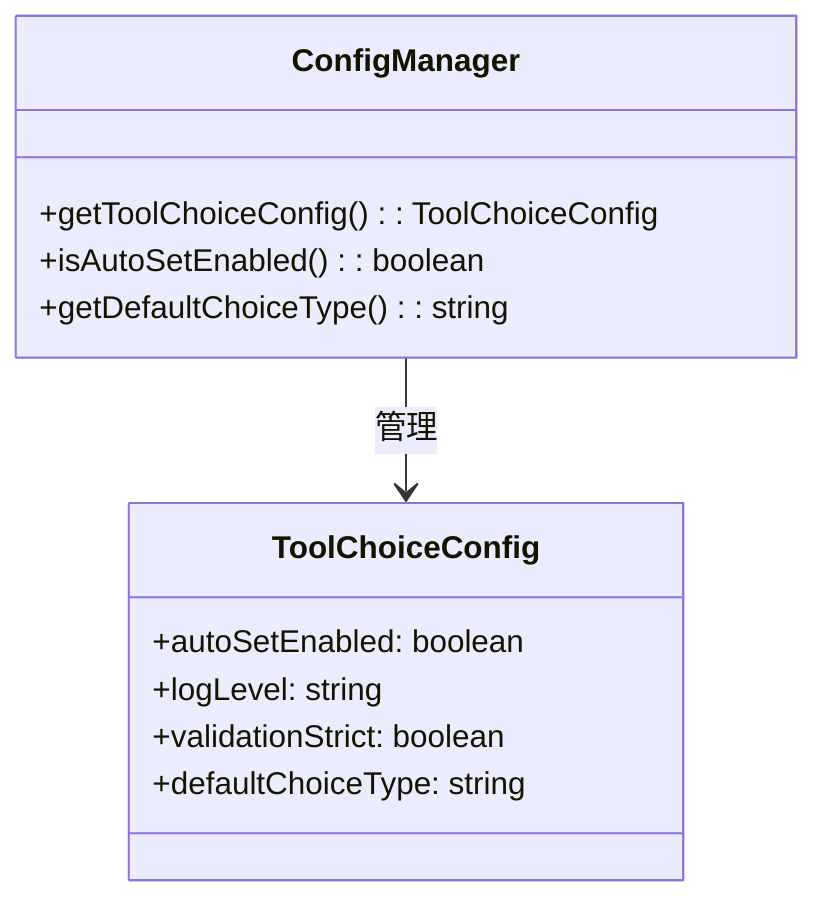

### 环境配置

| 配置项 | 环境变量 | 默认值 | 描述 |
|--------|----------|--------|------|
| 自动设置启用 | `TOOL_CHOICE_AUTO_SET` | `true` | 是否启用自动设置功能 |
| 日志级别 | `TOOL_CHOICE_LOG_LEVEL` | `info` | 工具选择相关日志级别 |
| 严格验证 | `TOOL_CHOICE_STRICT_VALIDATION` | `false` | 是否启用严格的工具验证 |

## 日志与监控

### 日志记录策略

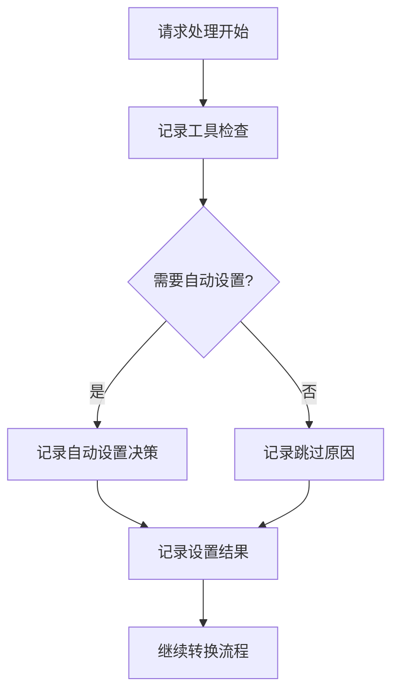

### 日志字段设计

```typescript
interface ToolChoiceLogEntry {
  requestId: string;
  timestamp: number;
  action: 'auto_set' | 'keep_user' | 'skip_empty' | 'validation_failed';
  toolsCount?: number;
  originalToolChoice?: any;
  finalToolChoice?: any;
  reason: string;
}
```

### 监控指标

| 指标名称 | 类型 | 描述 |
|----------|------|------|
| `tool_choice_auto_set_total` | Counter | 自动设置总次数 |
| `tool_choice_keep_user_total` | Counter | 保持用户设置总次数 |
| `tool_choice_validation_failed_total` | Counter | 验证失败总次数 |
| `tool_choice_processing_duration` | Histogram | 处理耗时分布 |

## 测试策略

### 单元测试覆盖

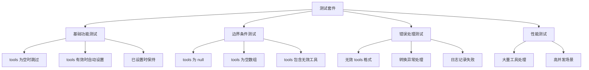

### 测试用例设计

#### 1. 正常流程测试

```typescript
interface TestCase {
  name: string;
  input: {
    tools?: AnthropicTool[];
    tool_choice?: any;
  };
  expected: {
    shouldAutoSet: boolean;
    finalToolChoice?: any;
    logAction: string;
  };
}
```

#### 2. 集成测试场景

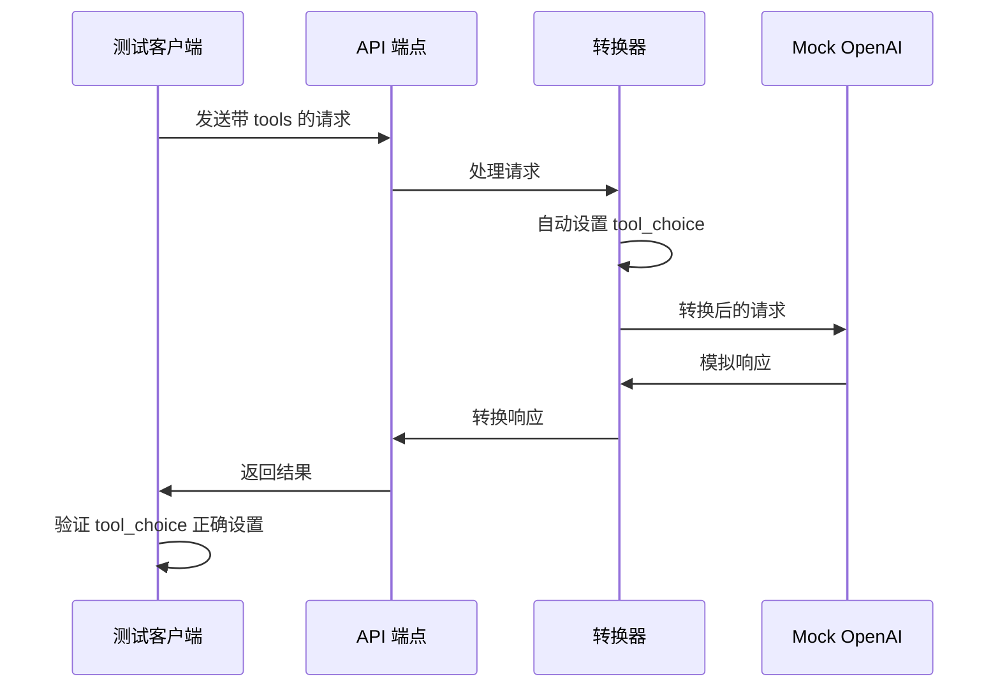

## 兼容性分析

### 向后兼容性

| 场景 | 行为变化 | 兼容性影响 |
|------|----------|------------|
| 无 tools 参数 | 无变化 | ✅ 完全兼容 |
| tools 为空数组 | 无变化 | ✅ 完全兼容 |
| tools 有效，无 tool_choice | 自动添加 tool_choice | ✅ 功能增强 |
| tools 有效，有 tool_choice | 保持用户设置 | ✅ 完全兼容 |

### API 契约保证

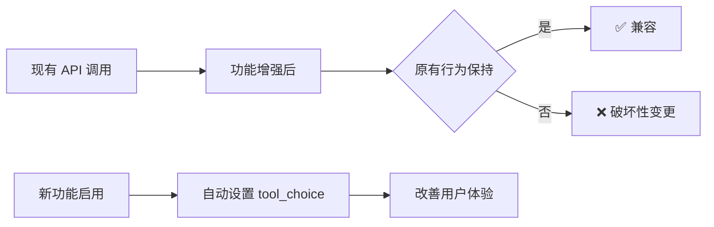

## 性能影响

### 性能分析

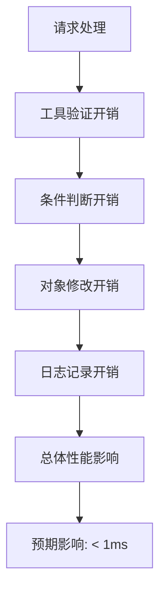

### 优化策略

1. **早期返回**: 在 tools 为空时立即跳过处理
2. **缓存验证**: 对工具格式验证结果进行缓存
3. **异步日志**: 使用异步方式记录非关键日志
4. **条件编译**: 在生产环境中可选择性关闭详细日志

## 部署计划

### 发布策略

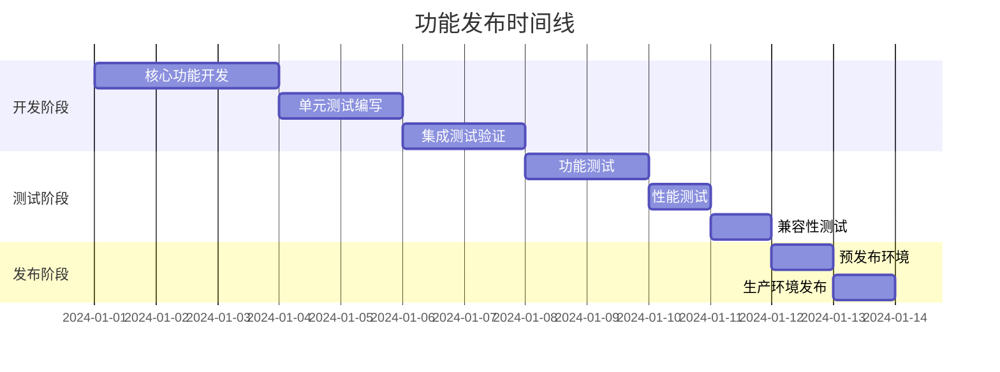

### 风险控制

| 风险类型 | 风险描述 | 缓解措施 |
|----------|----------|----------|
| 兼容性风险 | 可能影响现有用户 | 充分的回归测试 |
| 性能风险 | 增加处理延迟 | 性能基准测试 |
| 逻辑风险 | 自动设置逻辑错误 | 详细的单元测试 |
| 运维风险 | 部署过程中断服务 | 蓝绿部署策略 |

## 文档更新

### API 文档修改

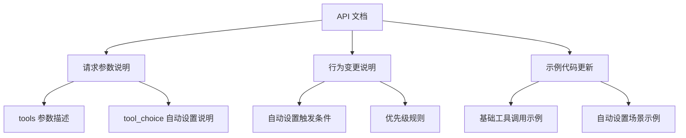

### 用户指南更新

1. **功能说明**: 详细说明自动设置功能的工作原理
2. **最佳实践**: 推荐的工具调用配置方式
3. **故障排除**: 常见问题及解决方案
4. **迁移指南**: 如何从手动设置迁移到自动设置

---

本设计确保了 tool_choice 自动设置功能的可靠实现，在提升用户体验的同时保持了系统的稳定性和兼容性。