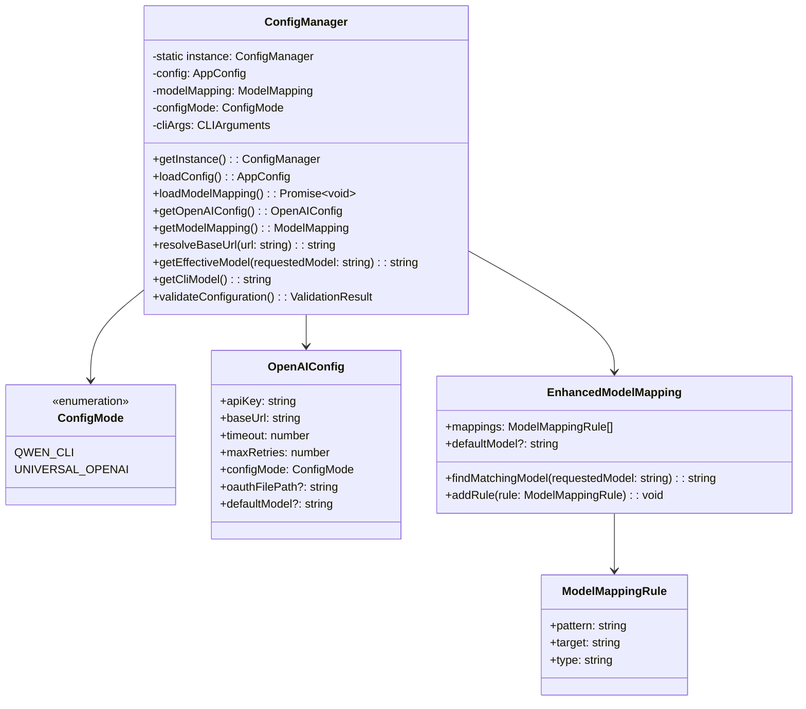
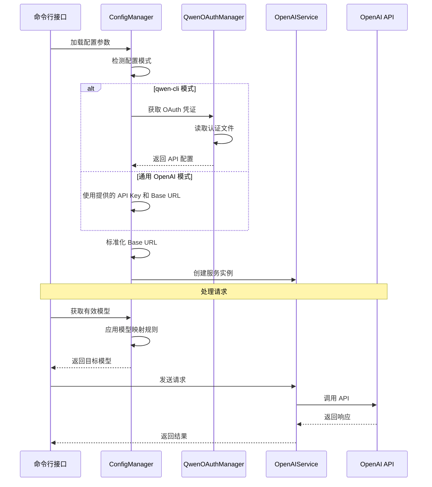
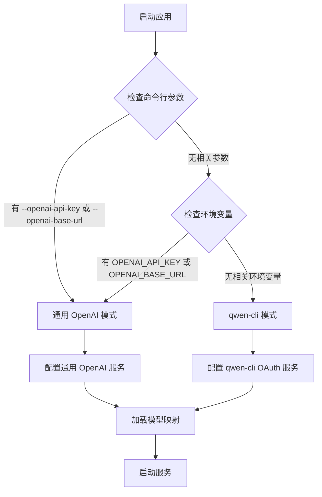

# 通用 OpenAI 配置功能设计

## 概述

本文档描述了将 OpenCC 项目从仅支持 qwen-cli 模式扩展为支持通用 OpenAI 配置的设计方案。该功能旨在提供更灵活的配置选项，支持自定义 OpenAI API 端点、认证方式和模型映射。

## 功能需求

### 1. 多种配置模式支持
- **qwen-cli 模式（默认）**：当无额外参数时，使用现有的 qwen-cli OAuth 认证
  - qwen-cli 自带默认模型：`qwen3-coder-plus`
  - 为了后期兼容，qwen-cli 可能会支持更多模型
- **通用 OpenAI 模式**：支持自定义 API Key 和 Base URL

### 2. 命令行参数扩展
- `--openai-api-key`：指定 OpenAI API 密钥
- `--openai-base-url`：指定 OpenAI API 端点 URL
- `--qwen-oauth-file`：指定 qwen OAuth 认证文件路径（qwen-cli 模式）
- `--model`：指定固定使用的模型
  - qwen-cli 模式默认使用 `qwen3-coder-plus`
  - 自定义 OpenAI 接口可支持更多模型
  - 可通过此参数覆盖默认模型
- `--model-mapping`：指定模型映射文件路径或 JSON 数据

### 3. Base URL 兼容性处理
- 自动处理带 `/v1` 后缀的 URL
- 自动处理末尾带 `/` 的 URL
- 确保标准化的 API 端点格式

### 4. 模型映射增强
- **简化配置**：只保留核心的模型映射关系，移除不必要的 `contextLength`、`maxTokens`、`capabilities` 字段
- 支持多种匹配模式：`contains`、`exact`、`prefix`、`suffix`
- 支持 `defaultModel` 配置
- 支持命令行 `--model` 参数，等价于 `defaultModel` 但优先级更低
- `--model-mapping` 中的 `defaultModel` 优先级高于 `--model` 参数
- 当所有映射规则都不匹配且没有默认模型时，使用原始模型（qwen-cli 有自带默认模型 `qwen3-coder-plus`）
- **向后兼容**：支持现有的 `model-mapping.json` 格式，自动忽略多余字段

## 架构设计

### 配置管理器扩展



### 服务层架构调整



## 详细设计

### 1. 配置模式检测

```typescript
enum ConfigMode {
  QWEN_CLI = 'qwen-cli',
  UNIVERSAL_OPENAI = 'universal-openai'
}

class ConfigManager {
  private detectConfigMode(): ConfigMode {
    const hasOpenAIKey = !!process.env.OPENAI_API_KEY || !!this.cliArgs.openaiApiKey;
    const hasOpenAIBaseUrl = !!process.env.OPENAI_BASE_URL || !!this.cliArgs.openaiBaseUrl;
    
    return (hasOpenAIKey || hasOpenAIBaseUrl) ? 
      ConfigMode.UNIVERSAL_OPENAI : 
      ConfigMode.QWEN_CLI;
  }
  
  getCliModel(): string | undefined {
    return this.cliArgs.model;
  }
  
  getEffectiveDefaultModel(): string | undefined {
    // model-mapping 中的 defaultModel 优先级高于 --model 参数
    return this.modelMapping.defaultModel || this.cliArgs.model;
  }
}
```

### 2. Base URL 标准化

```typescript
  private normalizeBaseUrl(url: string): string {
    let normalizedUrl = url.trim();
    
    // 移除末尾的斜杠
    normalizedUrl = normalizedUrl.replace(/\/+$/, '');
    
    // 如果URL以/v1结尾，移除它（因为/v1应该在endpoint path中）
    if (normalizedUrl.endsWith('/v1')) {
      normalizedUrl = normalizedUrl.slice(0, -3); // 移除 '/v1'
    }
    
    // 确保有协议头
    if (!normalizedUrl.startsWith('http://') && !normalizedUrl.startsWith('https://')) {
      normalizedUrl = 'https://' + normalizedUrl;
    }
    
    return normalizedUrl;
  }
```

### 3. 增强的模型映射系统

#### 简化的映射格式

针对现有 `model-mapping.json` 复杂度过高的问题，新的映射格式只保留核心的映射关系，采用 `docs/model-mapping.example.json` 的样式：

```json
{
  "mappings": [
    {
      "pattern": "claude-3-5",
      "target": "gpt-4-turbo-preview",
      "type": "contains"
    },
    {
      "pattern": "claude-3-opus",
      "target": "gpt-4-turbo-preview",
      "type": "contains"
    },
    {
      "pattern": "claude-3-sonnet",
      "target": "gpt-4",
      "type": "contains"
    },
    {
      "pattern": "claude-3-haiku",
      "target": "gpt-3.5-turbo",
      "type": "exact"
    },
    {
      "pattern": "qwen3-coder-plus",
      "target": "gpt-4",
      "type": "exact"
    }
  ],
  "defaultModel": "gpt-4"
}
```

#### 与现有格式的对比

**现有格式问题：**
- 包含不必要的 `contextLength`、`maxTokens`、`capabilities` 字段
- **经过代码分析确认：这些字段在实际业务逻辑中未被使用**
- 转换器只是直接传递 `anthropicRequest.max_tokens`，不做任何验证或限制
- 上下文长度限制应该由目标 API 服务自己处理
- 增加了配置复杂度和维护成本，但没有实际价值
- 对象格式不支持多个模式匹配同一个目标

**新数组格式的优势：**
- 只关注核心的模型名称映射关系
- 配置文件更简洁易读
- 支持更灵活的匹配模式（`contains`、`exact`、`prefix`、`suffix`）
- 数组格式支持按顺序匹配，更符合直觉
- 可以轻松实现复杂的映射规则
- 向后兼容现有的精确匹配方式

```typescript
interface ModelMappingRule {
  pattern: string;
  target: string;
  type: 'contains' | 'exact' | 'prefix' | 'suffix';
}

interface EnhancedModelMapping {
  mappings: ModelMappingRule[];
  defaultModel?: string;
}

class ModelMappingResolver {
  private mapping: EnhancedModelMapping;
  private cliModel?: string; // 来自 --model 参数
  
  findMatchingModel(requestedModel: string): string {
    // 1. 遍历映射规则，按顺序匹配
    for (const rule of this.mapping.mappings) {
      if (this.isMatch(requestedModel, rule.pattern, rule.type)) {
        return rule.target;
      }
    }
    
    // 2. 使用 model-mapping 中的 defaultModel（优先级高于 --model 参数）
    if (this.mapping.defaultModel) {
      return this.mapping.defaultModel;
    }
    
    // 3. 使用 --model 参数（等价于 defaultModel，但优先级较低）
    if (this.cliModel) {
      return this.cliModel;
    }
    
    // 4. 返回原始模型（qwen-cli 模式下会使用自带默认模型 qwen3-coder-plus）
    return requestedModel;
  }
  
  private isMatch(model: string, pattern: string, mode: string): boolean {
    switch (mode) {
      case 'exact': return model === pattern;
      case 'prefix': return model.startsWith(pattern);
      case 'suffix': return model.endsWith(pattern);
      case 'contains': 
      default: return model.includes(pattern);
    }
  }
}
```

### 4. 命令行参数处理

```typescript
interface CLIArguments {
  openaiApiKey?: string;
  openaiBaseUrl?: string;
  qwenOauthFile?: string;
  model?: string;
  modelMapping?: string;
}

class ConfigManager {
  private cliArgs: CLIArguments = {};
  
  parseCliArguments(): void {
    const args = process.argv.slice(2);
    
    for (let i = 0; i < args.length; i++) {
      switch (args[i]) {
        case '--openai-api-key':
          this.cliArgs.openaiApiKey = args[++i];
          break;
        case '--openai-base-url':
          this.cliArgs.openaiBaseUrl = args[++i];
          break;
        case '--qwen-oauth-file':
          this.cliArgs.qwenOauthFile = args[++i];
          break;
        case '--model':
          this.cliArgs.model = args[++i];
          break;
        case '--model-mapping':
          this.cliArgs.modelMapping = args[++i];
          break;
      }
    }
  }
}
```

## 配置优先级

### 参数优先级规则
1. 命令行参数 > 环境变量 > 配置文件 > 默认值
2. 模型选择优先级：请求中指定的模型 > 映射规则匹配 > `--model-mapping` 中的 `defaultModel` > `--model` 参数 > 原始模型（qwen-cli 下为 `qwen3-coder-plus`）
3. `--model` 参数等价于 `--model-mapping` 中的 `defaultModel`，但 `--model-mapping` 优先级更高

### 配置模式切换逻辑


## 实现计划

### 第一阶段：核心配置扩展
1. 扩展 `ConfigManager` 类支持多种配置模式
2. 实现 Base URL 标准化逻辑
3. 添加命令行参数解析功能

### 第二阶段：模型映射简化与增强
1. **简化模型映射格式**：只保留 `targetModel` 字段，移除不必要的元数据
2. 实现增强的模型映射系统
3. 支持多种匹配模式
4. 添加 `defaultModel` 支持
5. **实现向后兼容**：支持现有 `openaiModel` 格式

### 第三阶段：服务集成
1. 更新 `OpenAIService` 支持动态配置
2. 确保 `QwenOAuthManager` 兼容性
3. 实现配置验证和错误处理

### 第四阶段：测试和文档
1. 编写单元测试覆盖新功能
2. 更新使用文档和示例
3. 性能测试和优化

## 向后兼容性

### 模型映射格式兼容
- **新格式**：推荐使用简化的 `targetModel` 格式
- **现有格式**：继续支持现有的 `openaiModel` 格式，自动忽略 `contextLength`、`maxTokens`、`capabilities` 字段

```typescript
class ModelMappingLoader {
  loadMapping(data: any): EnhancedModelMapping {
    const mappings: ModelMappingRule[] = [];
    
    // 支持新的数组格式 (docs/model-mapping.example.json)
    if (data.mappings && Array.isArray(data.mappings)) {
      for (const mapping of data.mappings) {
        mappings.push({
          pattern: mapping.pattern,
          target: mapping.target,
          type: mapping.type || 'contains'
        });
      }
    }
    // 兼容现有的对象格式 (config/model-mapping.json)
    else {
      for (const [key, value] of Object.entries(data)) {
        if (typeof value === 'object' && value !== null && key !== 'defaultModel') {
          const target = (value as any).openaiModel || (value as any).targetModel;
          if (target) {
            mappings.push({
              pattern: key,
              target: target,
              type: 'exact' // 现有格式默认为精确匹配
            });
          }
        }
      }
    }
    
    return {
      mappings,
      defaultModel: data.defaultModel
    };
  }
}
```

### 其他兼容性保证
- 现有的 qwen-cli 模式保持完全兼容
- 环境变量配置继续有效

## 错误处理

### 配置验证
- 检查 API Key 格式的有效性
- 验证 Base URL 的可达性
- 模型映射文件格式验证

### 运行时错误处理
- API 连接失败的降级策略
- OAuth 认证失败的重试机制
- 模型不存在时的默认处理

## 安全考虑

- API Key 的安全存储和传输
- OAuth 文件权限检查
- 敏感信息的日志脱敏
- 配置文件的访问权限控制